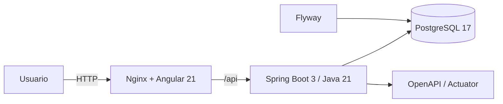
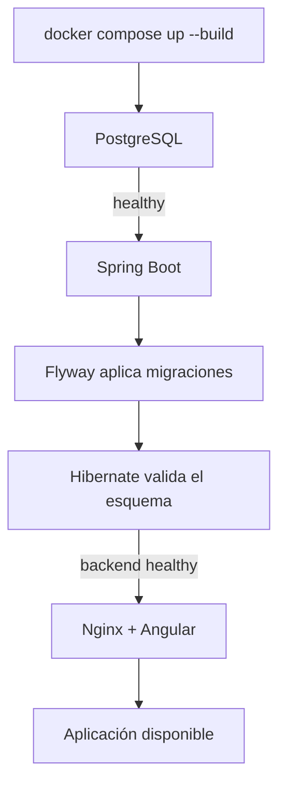
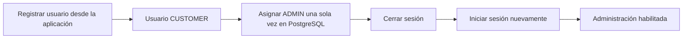
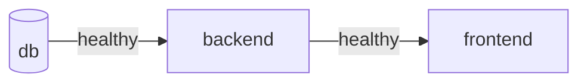
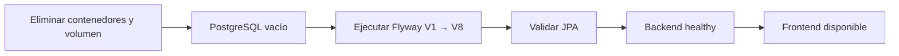
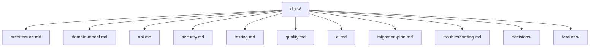

# LaunchForge

LaunchForge es una plataforma para comercializar paquetes de desarrollo web. La solución incluye autenticación, gestión de usuarios, catálogo, inventario, órdenes, descuentos, reportes y auditoría administrativa.

El objetivo de este README es permitir **configurar, ejecutar y validar el proyecto rápidamente**. La arquitectura, decisiones técnicas, modelo de dominio, seguridad, estrategia de pruebas y demás detalles se encuentran en [`docs/`](docs/).

## Vista rápida



### Componentes

| Componente | Tecnología | Responsabilidad |
| --- | --- | --- |
| Frontend | Angular 21 + Nginx | Interfaz web |
| Backend | Spring Boot 3 + Java 21 | API, seguridad y lógica de negocio |
| Base de datos | PostgreSQL 17 | Persistencia |
| Migraciones | Flyway | Creación y evolución controlada del esquema |
| Orquestación | Docker Compose | Ejecución reproducible del entorno |

## Requisitos

### Opción recomendada

- Docker Desktop
- Docker Compose

### Ejecución local sin contenedores

- Java 21
- Maven 3.9+
- Node.js `^22.22.3`, `^24.15.0` o `>=26.0.0`
- npm

## 1. Configurar variables de entorno

Crea `.env` a partir del archivo incluido en el repositorio.

### Linux / macOS

```bash
cp .env.example .env
```

### PowerShell

```powershell
Copy-Item .env.example .env
```

Los valores de `.env.example` están pensados exclusivamente para desarrollo local.

> Para cualquier entorno compartido cambia `POSTGRES_PASSWORD`, `SPRING_DATASOURCE_PASSWORD` y `JWT_SECRET`.

Con el `.env.example` actual se utilizan estos puertos:

```text
Frontend:   8088
Backend:    8080
PostgreSQL: 55432
```

Puedes cambiarlos directamente en `.env`.

## 2. Levantar la aplicación

```bash
docker compose up --build
```

El arranque sigue este flujo:



Los servicios no dependen únicamente del orden de creación de los contenedores: Compose utiliza healthchecks para esperar a que PostgreSQL y backend estén realmente disponibles.

## 3. URLs de desarrollo

Si utilizaste `.env.example` sin modificar los puertos:

| Servicio | URL |
| --- | --- |
| Aplicación | <http://localhost:8088> |
| Catálogo público | <http://localhost:8088/products> |
| Backend | <http://localhost:8080> |
| Health | <http://localhost:8080/actuator/health> |
| Swagger UI | <http://localhost:8080/swagger-ui/index.html> |
| OpenAPI JSON | <http://localhost:8080/v3/api-docs> |
| PostgreSQL | `localhost:55432` |

Si modificas `FRONTEND_HOST_PORT`, `BACKEND_HOST_PORT` o `DB_HOST_PORT`, utiliza los puertos definidos en tu `.env`.

## 4. Configurar el primer administrador

La instalación **no incluye usuarios demo ni un administrador preconfigurado**.

El registro normal de la aplicación crea usuarios con el rol `CUSTOMER`. Para habilitar el primer administrador:



### Paso 1. Registrar el usuario

Crea la cuenta desde el flujo normal de registro de LaunchForge.

Esto garantiza que la contraseña sea procesada por la aplicación mediante BCrypt y que el usuario se cree con la estructura esperada.

### Paso 2. Entrar a PostgreSQL

Si conservaste los valores de `.env.example`:

```bash
docker compose exec db psql -U launchforge -d launchforge
```

Si cambiaste `POSTGRES_USER` o `POSTGRES_DB`, utiliza esos valores.

### Paso 3. Verificar el usuario

Sustituye `admin@ejemplo.com` por el correo registrado:

```sql
SELECT
    u.id,
    u.email,
    u.enabled,
    r.name AS role
FROM users u
LEFT JOIN user_roles ur ON ur.user_id = u.id
LEFT JOIN roles r ON r.id = ur.role_id
WHERE LOWER(u.email) = LOWER('admin@ejemplo.com');
```

### Paso 4. Asignar el rol `ADMIN`

La relación de roles se almacena en `user_roles`; no existe una columna `role` dentro de `users`.

Ejecuta:

```sql
BEGIN;

DELETE FROM user_roles
WHERE user_id = (
    SELECT id
    FROM users
    WHERE LOWER(email) = LOWER('admin@ejemplo.com')
);

INSERT INTO user_roles (user_id, role_id)
SELECT u.id, r.id
FROM users u
CROSS JOIN roles r
WHERE LOWER(u.email) = LOWER('admin@ejemplo.com')
  AND r.name = 'ADMIN';

COMMIT;
```

Verifica el resultado:

```sql
SELECT
    u.email,
    u.enabled,
    r.name AS role
FROM users u
JOIN user_roles ur ON ur.user_id = u.id
JOIN roles r ON r.id = ur.role_id
WHERE LOWER(u.email) = LOWER('admin@ejemplo.com');
```

Resultado esperado:

```text
admin@ejemplo.com | true | ADMIN
```

Después del cambio, **cierra sesión e inicia sesión nuevamente** para generar un JWT con el rol actualizado.

> Este procedimiento solo es necesario para el bootstrap del primer administrador. A partir de ese momento, la gestión de usuarios, estados y roles se realiza desde las funcionalidades administrativas de LaunchForge.

## 5. Validar los contenedores

```bash
docker compose ps
```

El estado esperado es:



También puedes comprobar directamente el backend:

```text
http://localhost:8080/actuator/health
```

Respuesta esperada:

```json
{
  "status": "UP"
}
```

## 6. Ejecución local

Si necesitas trabajar sin ejecutar backend y frontend dentro de Docker, puedes utilizar únicamente PostgreSQL desde Compose.

### Base de datos

```bash
docker compose up -d db
```

### Backend

```bash
cd backend
mvn spring-boot:run
```

### Frontend

```bash
cd frontend
npm ci
npm start
```

## 7. Base de datos y migraciones

Flyway es responsable de crear y evolucionar el esquema.

La aplicación utiliza:

```properties
spring.flyway.enabled=true
spring.jpa.hibernate.ddl-auto=validate
```

El repositorio contiene una baseline consolidada de ocho migraciones versionadas, desde `V1` hasta `V8`.

```text
V1  Identity
V2  Catalog
V3  Inventory
V4  Orders
V5  Discounts
V6  Audit
V7  Indexes
V8  Initial catalog data
```

Hibernate **no modifica automáticamente** el esquema: únicamente valida que las entidades JPA sean compatibles con la estructura creada por Flyway.

A partir de la baseline publicada, los cambios posteriores deben incorporarse mediante nuevas migraciones incrementales sin reescribir las versiones existentes.

### Validar instalación desde cero

Para comprobar que el proyecto es reproducible sobre una base completamente limpia:

```bash
docker compose down -v
docker compose up --build
```



> `docker compose down -v` elimina los datos locales almacenados en el volumen de PostgreSQL. Utilízalo únicamente cuando quieras reconstruir deliberadamente la base local.

La estrategia completa de migraciones está documentada en [`docs/migration-plan.md`](docs/migration-plan.md).

## 8. Builds, tests y calidad

### Verificación del backend

Desde la raíz:

```bash
mvn -f backend/pom.xml clean verify
```

O:

```bash
cd backend
mvn clean verify
```

El gate `clean verify` ejecuta la validación completa del backend, incluyendo pruebas y generación de cobertura JaCoCo.

### Verificación del frontend

```bash
cd frontend
npm ci
npm run lint
npm test -- --watch=false
npm run build
```

### Validar Compose

```bash
docker compose config
```

### Makefile

También están disponibles:

```text
make up
make down
make reset
make logs
make logs-backend
make logs-db
make test
make build
```

## 9. Integración y entrega continua

GitHub Actions valida backend y frontend de forma independiente antes de integrar cambios.

Los gates principales son:

```text
Backend CI  -> mvn clean verify
Frontend CI -> npm ci + lint + test + build
```

El workflow de release vuelve a ejecutar ambos gates antes de publicar imágenes de backend y frontend en GHCR.

La automatización actual cubre **Continuous Delivery hasta GHCR**. El despliegue automático hacia un proveedor específico queda fuera del alcance mientras no exista un entorno de destino definido.

Más detalles en [`docs/ci.md`](docs/ci.md).

## 10. Checklist rápido

Antes de considerar el entorno listo:

```text
[ ] .env creado
[ ] docker compose up --build finaliza correctamente
[ ] db aparece healthy
[ ] backend aparece healthy
[ ] frontend responde
[ ] /actuator/health devuelve UP
[ ] usuario registrado
[ ] primer ADMIN configurado si es una instalación nueva
[ ] login correcto
[ ] catálogo accesible
[ ] Swagger accesible
[ ] tests backend verdes
[ ] lint, tests y build frontend verdes
```

## Documentación

La documentación técnica ampliada se encuentra en [`docs/`](docs/).



Documentos principales:

- [Arquitectura](docs/architecture.md)
- [Modelo de dominio](docs/domain-model.md)
- [API](docs/api.md)
- [Seguridad](docs/security.md)
- [Pruebas](docs/testing.md)
- [Calidad](docs/quality.md)
- [Integración continua](docs/ci.md)
- [Plan de migraciones](docs/migration-plan.md)
- [Troubleshooting](docs/troubleshooting.md)

Las decisiones y funcionalidades específicas se documentan adicionalmente en:

```text
docs/decisions/
docs/features/
```
