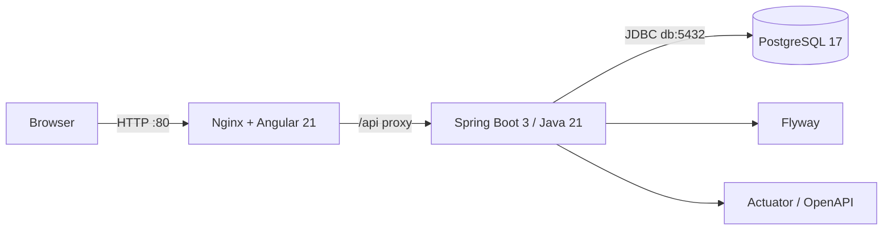

# LaunchForge

LaunchForge es una plataforma para comercializar paquetes de desarrollo web. Incluye autenticación JWT, catálogo, inventario concurrente, órdenes idempotentes, descuentos configurables, reportes y auditoría funcional para administradores.

## Arquitectura actual



- `frontend`: SPA standalone, routing, TypeScript estricto y Angular Material; Nginx la sirve en producción.
- `backend`: Spring Boot 3 sobre Java 21 con JPA, Flyway, Security stateless, JWT y BCrypt.
- `db`: PostgreSQL persistente con migraciones versionadas V1-V11 y datos demo deterministas.

## Requisitos

- Docker Desktop con Compose, opción recomendada.
- Para ejecución local: Java 21, Maven 3.9+, Node 22.22.3/24.15+ y npm.

## Inicio con Docker

```bash
cp .env.example .env
docker compose up --build
```

En PowerShell: `Copy-Item .env.example .env`.

Servicios:

- Frontend: <http://localhost> por defecto, o `http://localhost:${FRONTEND_HOST_PORT}` si cambias el puerto.
- Catálogo público: <http://localhost/products> por defecto.
- Backend health: <http://localhost:8080/actuator/health> por defecto, o `http://localhost:${BACKEND_HOST_PORT}/actuator/health`.
- Swagger UI: <http://localhost:8080/swagger-ui/index.html> por defecto, o `http://localhost:${BACKEND_HOST_PORT}/swagger-ui/index.html`.
- OpenAPI JSON: <http://localhost:8080/v3/api-docs> por defecto, o `http://localhost:${BACKEND_HOST_PORT}/v3/api-docs`.
- PostgreSQL: `localhost:5432` por defecto, o `localhost:${DB_HOST_PORT}`.

Si un puerto ya está ocupado en tu máquina, ajusta `.env` antes de levantar Compose. Ejemplo:

```bash
DB_HOST_PORT=5433
BACKEND_HOST_PORT=8081
FRONTEND_HOST_PORT=8088
```

Los valores de `.env.example` son solo para desarrollo; cambia la contraseña en cualquier entorno compartido.

## Ejecución local

Primero inicia PostgreSQL, por ejemplo `docker compose up -d db`, y conserva la URL local por defecto de `application.yml`.

```bash
cd backend
mvn spring-boot:run
```

```bash
cd frontend
npm ci
npm start
```

Angular 21 requiere Node 22.22.3 o Node 24.15.0. El contenedor usa Node 24.15.0 y NgRx Signals 21 compatible.

## Builds y tests

```bash
mvn -f backend/pom.xml clean verify
cd frontend && npm ci && npm run build
cd frontend && npm test -- --watch=false
docker compose config
```

También existen `make up`, `down`, `reset`, `logs`, `logs-backend`, `logs-db`, `test` y `build`.

## Base de datos

`spring.flyway.enabled=true` y `ddl-auto=validate`. Flyway administra el esquema con migraciones V1-V11; Hibernate valida el mapeo JPA contra PostgreSQL en cada arranque.

## Decisiones y alcance

- Un monolito modular evita complejidad distribuida prematura.
- Nginx entrega archivos estáticos y resuelve rutas SPA; además deja preparado el proxy `/api`.
- Compose ordena el arranque por salud real: DB, backend y frontend.
- Credenciales demo actuales:
  - `admin@launchforge.dev` / `launchforge-demo`
  - `customer@launchforge.dev` / `launchforge-demo`
  - `frequent@launchforge.dev` / `launchforge-demo`

Consulta [Architecture](docs/architecture.md), [API](docs/api.md), [Security](docs/security.md), [Testing](docs/testing.md), [Troubleshooting](docs/troubleshooting.md), [F08 Audit](docs/features/F08-audit.md) y [ADR Auditing](docs/decisions/ADR-auditing.md).
