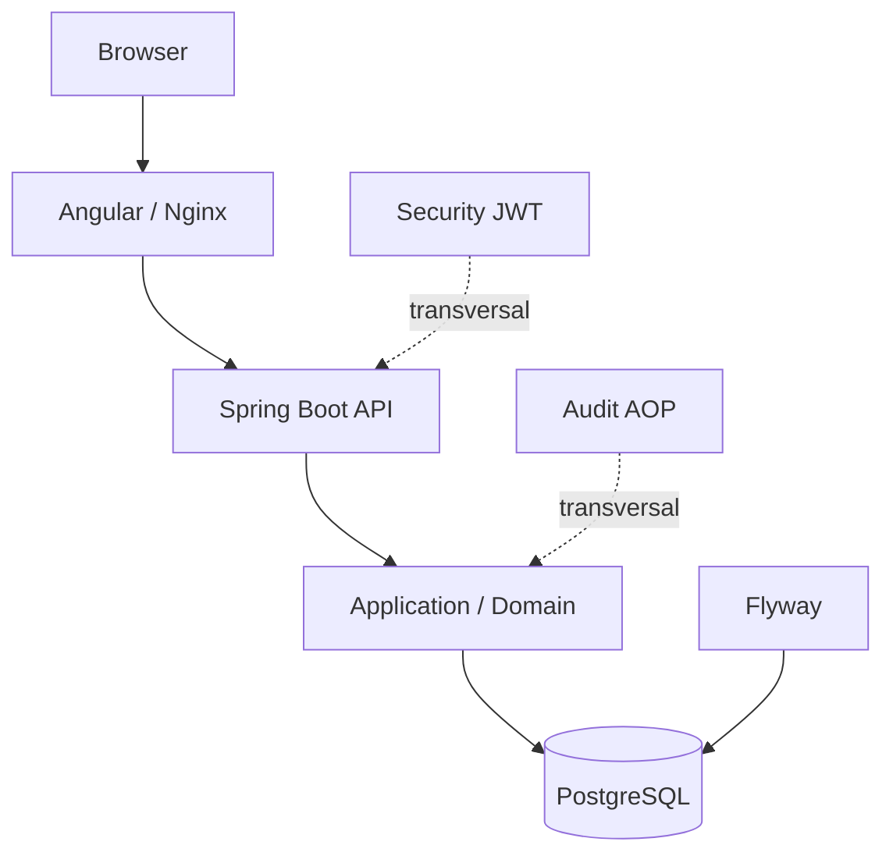
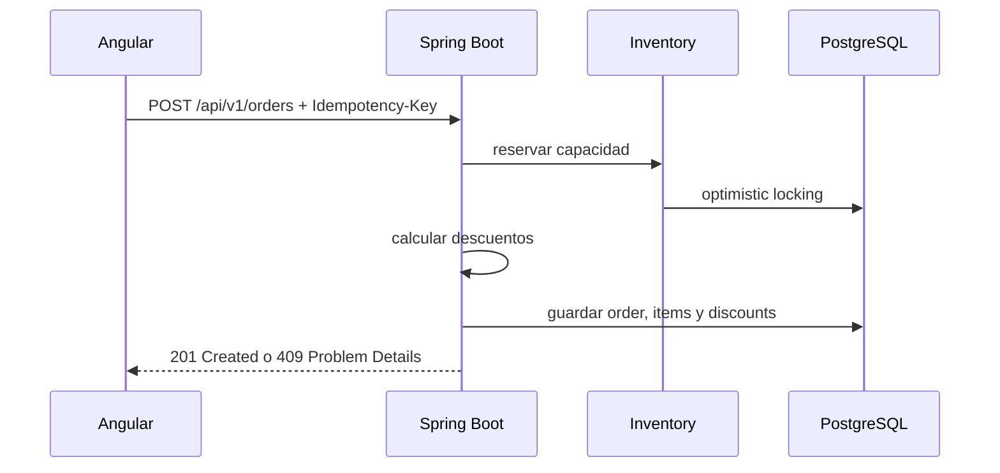
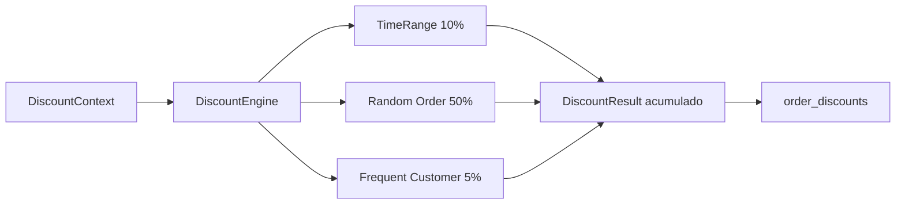

# Architecture

## Vista de despliegue

## Flujo de una orden

## Discount Engine

LaunchForge mantiene un monorepo con tres piezas principales:

- `frontend`: Angular 21 standalone, Angular Material, NgRx Signal Store y routing lazy

El frontend separa HTTP y estado compartido en `core`, páginas en `features` y piezas reutilizables en `shared`. `/admin/**` tiene layout secundario y guards de autenticación y rol.
- `backend`: Spring Boot 3.5, JPA, Flyway, Security stateless y OpenAPI
- `db`: PostgreSQL 17 con esquema versionado por Flyway

## Capas backend

La organización actual sigue una separación pragmática:

- `api`: controllers y DTOs HTTP
- `application`: casos de uso, mappers y criterios de búsqueda
- `infrastructure`: repositorios JPA y acceso a persistencia
- `persistence.model`: entidades JPA
- `shared`: seguridad, excepciones y clases base

## Flujo principal de Fase 3

Público:

`Browser -> Angular catalog page -> GET /api/v1/products -> Specification -> PostgreSQL`

ADMIN:

`Angular admin page -> JWT interceptor -> ProductController -> ProductCatalogService -> Repository -> PostgreSQL`

## Flujo principal de Fase 4

ADMIN inventory:

`Angular admin inventory page -> JWT interceptor -> InventoryController -> InventoryManagementService -> InventoryRepository -> PostgreSQL`

Concurrencia:

`TX A + TX B -> leen inventory.version = N -> una confirma -> la otra falla por optimistic locking -> API 409`

## Flujo principal de Fase 5

Checkout:

`Angular cart/checkout -> OrdersStore -> OrdersApiService -> OrderController -> CreateOrderUseCase -> TransactionalOrderCreator -> reserva de Inventory + OrderRepository -> PostgreSQL`

La orden se crea como `CREATED` (pendiente de confirmación). ADMIN la confirma con `PATCH /api/v1/orders/{id}/confirm`; la reserva pasa a consumo definitivo y el estado cambia a `CONFIRMED`. Cancelar `CREATED` libera la reserva; cancelar `CONFIRMED` restaura capacidad consumida.

Consulta:

`Angular orders page -> OrdersApiService -> OrderController -> OrderQueryService -> OrderRepository -> PostgreSQL`

Cancelación:

`Angular order detail -> OrdersApiService -> OrderController -> CancelOrderUseCase -> InventoryManagementService.restoreCapacity -> PostgreSQL`

## Decisiones relevantes

- PostgreSQL es la fuente persistente de verdad
- Flyway controla evolución de esquema
- Hibernate solo valida
- JWT y `@PreAuthorize` mantienen seguridad backend real
- DTOs aíslan API de entidades
- `JpaSpecificationExecutor` resuelve búsqueda dinámica sin memoria intermedia
- `Inventory` centraliza invariantes de capacidad
- `@Version` protege capacidad contra race conditions sin locks en memoria
- la creación de órdenes usa una transacción corta y explícita
- las órdenes pendientes reservan capacidad: disminuye `available_quantity` y aumenta `reserved_quantity`
- la idempotencia se apoya en un header HTTP y una restricción única en PostgreSQL
- `order_items` conserva snapshots para proteger histórico frente a cambios del catálogo

## Flujo principal de Fase 6

Discount pipeline:

`Checkout -> TransactionalOrderCreator -> DiscountEngine -> DiscountConfigurationService -> DiscountStrategy[] -> order_discounts + orders.total`

Orden actual:

1. `TIME_RANGE`
2. `RANDOM_ORDER`
3. `FREQUENT_CUSTOMER`

Decisiones específicas:

- los descuentos combinables se calculan linealmente sobre el subtotal original y se suman sus porcentajes aplicados;
- `DiscountEngine` recibe estrategias por DI;
- `RandomProvider` desacopla producción y tests;
- `OrderDiscount` conserva trazabilidad histórica aunque cambie la configuración;
- `DiscountConfigurationService` evita queries duplicadas por estrategia.

## Flujo principal de Fase 7

Reports:

`Angular /admin/reports -> ReportStore -> ReportApiService -> ReportController -> ReportQueryService -> ReportRepository -> PostgreSQL`

El módulo `report` está separado de catálogo, órdenes y usuarios. `ReportRepository` ejecuta SQL nativo agregado y entrega interface projections cerradas. PostgreSQL filtra estados, agrupa, ordena y limita; la capa application solo adapta projections a records de API. `@PreAuthorize` exige `ADMIN` en backend.

## Flujo principal de Fase 8

Auditoría funcional:

`Caso de uso mutable -> @Transactional + @LogAction -> AuditAspect -> AuditWriter -> audit_log`

La transacción envuelve al Aspect y AuditWriter exige propagación MANDATORY; acción y auditoría se confirman o revierten juntas. CorrelationIdFilter valida o crea X-Correlation-Id y lo añade a la respuesta y a MDC.

Consulta:

`Angular /admin/audit -> AuditStore -> AuditController -> AuditQueryService/Specification -> PostgreSQL`

JPA Auditing completa campos técnicos de entidades; AuditLog representa eventos funcionales. Son mecanismos complementarios.
