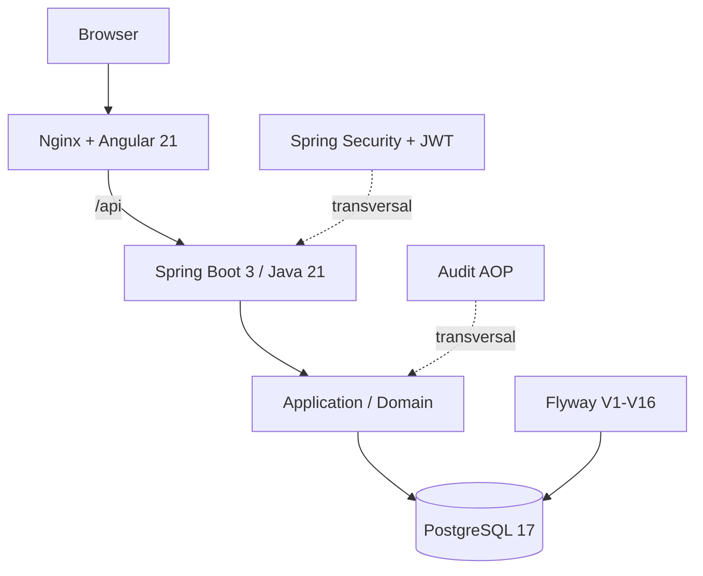
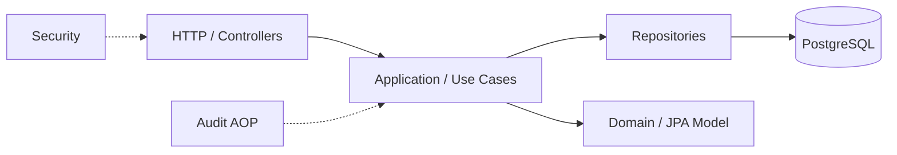
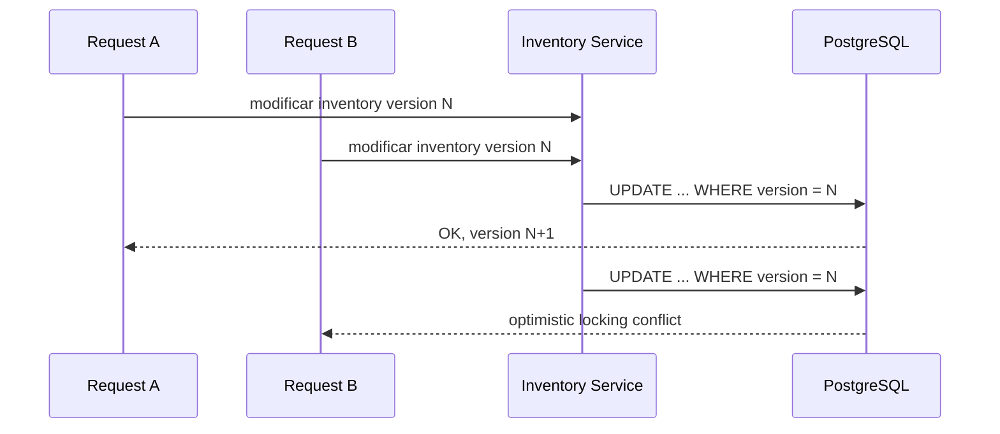
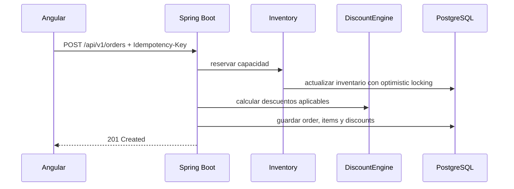
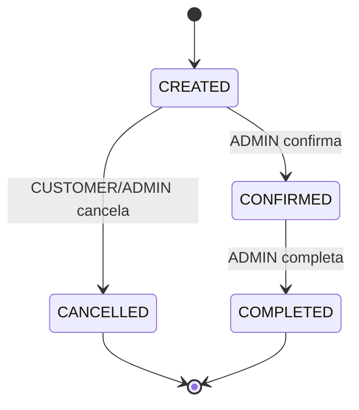
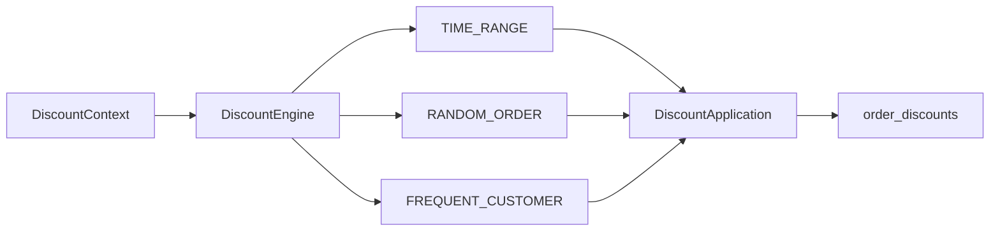
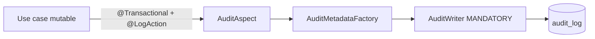
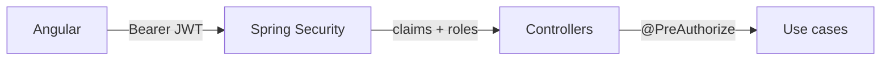

# Architecture

LaunchForge se implementa como un **monolito modular** en un monorepo con frontend Angular, backend Spring Boot y PostgreSQL. La separación se realiza por capacidades de negocio dentro de una única aplicación backend, evitando complejidad distribuida innecesaria para el alcance actual.

## Vista de despliegue



## Componentes

- `frontend`: Angular 21 standalone, Angular Material, NgRx Signals y routing lazy.
- `backend`: Spring Boot 3, Java 21, Spring Security, JPA, Flyway, OpenAPI y Actuator.
- `db`: PostgreSQL 17, esquema versionado exclusivamente con Flyway.
- `nginx`: sirve el build estático del frontend y reenvía `/api` al backend.

El frontend separa:

- `core`: sesión, guards, interceptor, clientes HTTP, modelos y stores compartidos;
- `features`: pantallas y flujos funcionales;
- `shared`: piezas visuales reutilizables.

## Capas backend

La organización sigue una separación pragmática:



- `api`: controllers y DTOs HTTP;
- `application`: casos de uso, servicios de aplicación y reglas de negocio;
- `infrastructure`: repositorios y acceso a persistencia;
- `persistence.model`: entidades JPA;
- `shared`: seguridad, excepciones y utilidades transversales.

## Catálogo

```text
Browser
  -> Angular catalog
  -> GET /api/v1/products
  -> ProductController
  -> ProductCatalogService
  -> JpaSpecificationExecutor
  -> PostgreSQL
```

Las búsquedas, paginación y ordenamiento se ejecutan en base de datos.

## Inventario y concurrencia



`Inventory` mantiene:

- `available_quantity`;
- `reserved_quantity`;
- `version`.

`@Version` protege la capacidad frente a actualizaciones concurrentes sin utilizar locks en memoria.

## Flujo de órdenes



La creación conserva snapshots comerciales en `order_items` y almacena los descuentos aplicados en `order_discounts`.

### Estados



Reglas relevantes:

- `CREATED` representa una orden pendiente y mantiene capacidad reservada;
- confirmar consume la reserva y cambia a `CONFIRMED`;
- solo `CREATED` puede cancelarse;
- cancelar `CREATED` libera la reserva;
- `CONFIRMED` y `COMPLETED` son definitivas y no se cancelan.

## Requerimientos comerciales de una orden

Además de los items, una orden almacena información del requerimiento:

- descripción del requerimiento;
- objetivo del proyecto;
- correo de contacto;
- teléfono opcional;
- fecha deseada de entrega opcional;
- referencias URL opcionales.

Estos campos forman parte de `orders` desde `V16__add_order_requirements.sql`.

## Idempotencia

`POST /api/v1/orders` acepta `Idempotency-Key`.

La unicidad se protege en PostgreSQL por cliente y llave:

```text
(customer_id, idempotency_key)
```

cuando la llave no es nula.

Esto evita crear dos órdenes por reintentos de la misma intención de checkout.

## Discount Engine



Las reglas se implementan mediante `DiscountStrategy` y se cargan desde `discount_configuration`.

Orden de trazabilidad:

1. `TIME_RANGE`;
2. `RANDOM_ORDER`;
3. `FREQUENT_CUSTOMER`.

Los descuentos aplicables se calculan de forma lineal sobre el **subtotal original** y sus importes se acumulan.

## Reportes

```text
Angular /admin/reports
  -> ReportStore
  -> ReportApiService
  -> ReportController
  -> ReportQueryService
  -> ReportRepository
  -> PostgreSQL
```

Las agregaciones se ejecutan en PostgreSQL. El frontend recibe resultados preparados y no reproduce reglas de negocio.

Reportes principales:

- productos activos;
- top 5 productos vendidos;
- top 5 clientes;
- dashboard operativo.

Los rankings consideran únicamente órdenes `CONFIRMED` y `COMPLETED`.

## Auditoría



La transacción de negocio envuelve el aspecto; un evento de éxito se confirma o revierte junto con la operación.

`CorrelationIdFilter` valida o genera `X-Correlation-Id`, lo devuelve en la respuesta y lo expone al contexto de auditoría.

## Seguridad



- autenticación stateless;
- JWT firmado;
- BCrypt para passwords;
- `ADMIN` y `CUSTOMER`;
- guards Angular para UX;
- autorización real en backend.

## Persistencia

- PostgreSQL es la fuente persistente de verdad;
- Flyway controla evolución del esquema;
- Hibernate usa `ddl-auto=validate`;
- no se usa `ddl-auto=update`;
- dinero usa `NUMERIC`/`BigDecimal`;
- timestamps usan UTC;
- las migraciones compartidas no se reescriben.

## Decisiones relacionadas

- [ADR auditoría](decisions/ADR-auditing.md)
- [ADR Discount Engine](decisions/ADR-discount-engine.md)
- [ADR idempotencia](decisions/ADR-idempotency.md)
- [ADR concurrencia de inventario](decisions/ADR-inventory-concurrency.md)
- [ADR frontera transaccional de órdenes](decisions/ADR-order-transaction-boundary.md)
