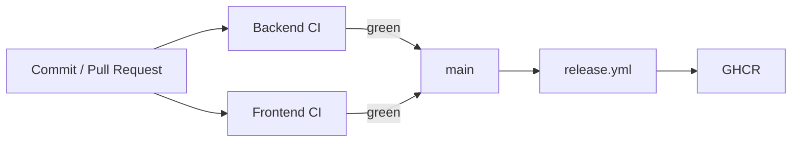

# Integración y entrega continua

LaunchForge usa GitHub Actions para validar backend y frontend y para publicar imágenes versionadas.



## Backend CI

`.github/workflows/backend-ci.yml` se ejecuta en `push` y `pull_request` hacia `main`.

Entorno:

- Ubuntu 24.04;
- Temurin Java 21;
- cache Maven.

Gate:

```bash
cd backend
mvn --batch-mode clean verify
```

El workflow publica siempre el reporte JaCoCo como artefacto `backend-jacoco`.

## Frontend CI

`.github/workflows/frontend-ci.yml` se ejecuta en `push` y `pull_request` hacia `main`.

Entorno:

- Ubuntu 24.04;
- Node `22.22.3`;
- cache npm.

Gates:

```bash
cd frontend
npm ci
npm run lint
npm run test -- --watch=false
npm run build
```

## Estado validado

Para el commit de `main`:

```text
4a6a7643557d5ab121e3f4978d3be36b7d445aeb
```

Backend CI y Frontend CI finalizaron correctamente.

## Continuous Delivery

`release.yml` se activa en:

- `main`;
- tags `v*`;
- ejecución manual.

Antes de publicar imágenes vuelve a ejecutar los gates de backend y frontend.

Después:

- construye imágenes para `linux/amd64` y `linux/arm64`;
- genera SBOM;
- genera provenance;
- publica atestaciones;
- publica en GHCR usando `GITHUB_TOKEN`.

Imágenes:

```text
ghcr.io/cristhianlagunam/launchforge-backend
ghcr.io/cristhianlagunam/launchforge-frontend
```

Etiquetas:

- `latest`: último `main` válido;
- `sha-<commit>`: referencia inmutable;
- `v*`: versión etiquetada.

## Release con Docker Compose

`docker-compose.release.yml` consume imágenes ya publicadas y recibe secretos mediante variables de entorno.

La automatización cubre **Continuous Delivery hasta GHCR**.

Continuous Deployment a un proveedor específico queda fuera del alcance actual porque no existe un entorno de destino definido; no se incluye infraestructura ficticia ni credenciales simuladas.
