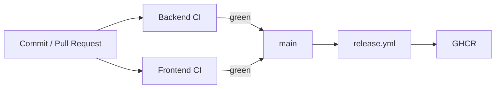
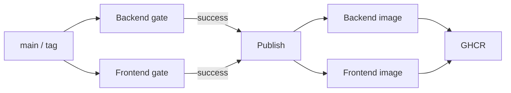

# Integración y entrega continua

LaunchForge usa GitHub Actions para validar backend y frontend y para publicar imágenes versionadas.



## Backend CI

`.github/workflows/backend-ci.yml` se ejecuta en `push` y `pull_request` hacia `main`.

Entorno:

- Ubuntu 24.04;
- Temurin Java 21;
- cache Maven;
- `actions/checkout@v6`;
- `actions/setup-java@v5`.

Gate:

```bash
cd backend
mvn --batch-mode clean verify
```

El objetivo del gate es validar en una sola ejecución:

- compilación;
- pruebas unitarias;
- pruebas de integración;
- validación de persistencia y migraciones;
- generación de cobertura JaCoCo.

Cuando el reporte JaCoCo está disponible, el workflow lo publica como artefacto `backend-jacoco`.

La publicación del artefacto se ejecuta incluso si una etapa anterior falla para facilitar el diagnóstico. Si el directorio del reporte no existe, la ausencia del artefacto no debe provocar un fallo adicional del workflow.

## Frontend CI

`.github/workflows/frontend-ci.yml` se ejecuta en `push` y `pull_request` hacia `main`.

Entorno:

- Ubuntu 24.04;
- Node `22.22.3`;
- cache npm;
- `actions/checkout@v6`;
- `actions/setup-node@v5`.

Gates:

```bash
cd frontend
npm ci
npm run lint
npm run test -- --watch=false
npm run build
```

El pipeline valida que el frontend pueda instalarse de forma reproducible, superar el análisis estático, ejecutar sus pruebas y generar correctamente el build de producción.

## Política de integración

Los workflows de backend y frontend funcionan como gates independientes.

Antes de integrar cambios a `main` se espera que ambos finalicen correctamente:

```text
Backend CI  -> success
Frontend CI -> success
```

Esta documentación evita fijar un SHA específico como referencia permanente, ya que el commit validado cambia con cada integración.

El estado real de una revisión debe consultarse directamente en GitHub Actions para el commit o Pull Request correspondiente.

## Continuous Delivery

`.github/workflows/release.yml` se activa mediante:

- `push` a `main`;
- tags `v*`;
- ejecución manual con `workflow_dispatch`.

Antes de publicar imágenes, el workflow vuelve a ejecutar los gates funcionales del backend y frontend.



### Backend gate

Ejecuta:

```bash
cd backend
mvn --batch-mode clean verify
```

Utiliza:

- Ubuntu 24.04;
- Temurin Java 21;
- cache Maven;
- `actions/checkout@v6`;
- `actions/setup-java@v5`.

### Frontend gate

Ejecuta:

```bash
cd frontend
npm ci
npm run lint
npm run test -- --watch=false
npm run build
```

Utiliza:

- Ubuntu 24.04;
- Node `22.22.3`;
- cache npm;
- `actions/checkout@v6`;
- `actions/setup-node@v5`.

## Publicación de imágenes

La etapa `publish` solo se ejecuta después de que los gates de backend y frontend hayan finalizado correctamente.

Las imágenes se construyen para:

```text
linux/amd64
linux/arm64
```

El proceso de publicación:

- configura QEMU;
- configura Docker Buildx;
- autentica contra GHCR usando `GITHUB_TOKEN`;
- genera metadata de las imágenes;
- construye imágenes multi-arquitectura;
- utiliza cache de GitHub Actions;
- genera SBOM;
- genera provenance;
- publica atestaciones;
- publica las imágenes en GHCR.

Imágenes:

```text
ghcr.io/cristhianlagunam/launchforge-backend
ghcr.io/cristhianlagunam/launchforge-frontend
```

Etiquetas:

- `latest`: último `main` publicado correctamente;
- `sha-<commit>`: referencia asociada al commit;
- `v*`: versión etiquetada.

La etiqueta `sha-<commit>` permite conservar una referencia reproducible de la imagen correspondiente a una revisión específica.

## Seguridad del pipeline

Los workflows utilizan permisos mínimos a nivel global:

```text
contents: read
```

La etapa de publicación amplía únicamente los permisos necesarios para publicar y atestar imágenes:

```text
contents: read
packages: write
attestations: write
id-token: write
```

Las credenciales de GHCR se obtienen mediante:

```text
GITHUB_TOKEN
```

No se almacenan credenciales de registro directamente dentro del repositorio.

## Release con Docker Compose

`docker-compose.release.yml` consume imágenes previamente publicadas en GHCR y recibe configuración sensible mediante variables de entorno.

Este archivo permite ejecutar una versión construida por el pipeline sin reconstruir localmente los componentes de la aplicación.

La automatización actual cubre:

```text
Continuous Integration
        ↓
Validación de backend y frontend
        ↓
Construcción de imágenes
        ↓
SBOM + provenance + attestations
        ↓
Publicación en GHCR
        ↓
Continuous Delivery
```

## Alcance de despliegue

LaunchForge implementa **Continuous Delivery hasta GHCR**.

El Continuous Deployment hacia un proveedor específico queda fuera del alcance actual porque no existe un entorno de destino definido.

Por esta razón no se incluyen:

- infraestructura ficticia;
- credenciales simuladas;
- despliegues automáticos hacia proveedores no utilizados por el proyecto.

Cuando exista un entorno de destino real, la etapa de despliegue podrá incorporarse después de la publicación de imágenes sin modificar los gates de calidad existentes.
