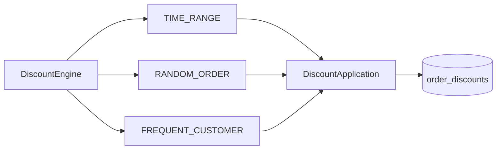

# ADR: Discount Engine Strategy Pipeline

## Status

Accepted

## Context

LaunchForge aplica reglas de descuento:

- rango temporal;
- orden aleatoria;
- cliente frecuente.

Deben ser extensibles, testeables, configurables y trazables.

## Decision

Se adopta `DiscountEngine` con un pipeline ordenado de `DiscountStrategy`.

Cada estrategia:

- declara su código;
- decide aplicabilidad;
- usa configuración cargada desde DB;
- produce una aplicación trazable.

Los descuentos combinables se calculan sobre el **subtotal original** y sus importes se acumulan.

## Alternatives

### `if/else` central

Descartado porque mezcla reglas y dificulta extensión/pruebas.

### Instanciar estrategias manualmente

Descartado porque rompe inversión de dependencias.

## Consequences

### Positivas

- Open/Closed;
- random determinista en tests;
- reglas configurables;
- historial persistido.

### Costos

- más clases;
- convención de `applicationOrder`;
- validación estricta de configuración.
