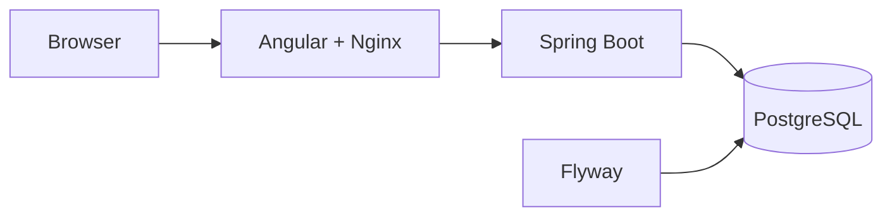

# Guion técnico de demo

Duración sugerida: **12–18 minutos**.

La demo debe ejecutarse sobre el mismo commit entregado y no debe simular respuestas.

## 0. Preparación

Crear variables:

```bash
cp .env.example .env
```

o en PowerShell:

```powershell
Copy-Item .env.example .env
```

Para demostrar reproducibilidad:

```bash
docker compose down -v
docker compose up --build
```

Con `.env.example`:

```text
Frontend: http://localhost:8088
Swagger:  http://localhost:8080/swagger-ui/index.html
Health:   http://localhost:8080/actuator/health
```

## 1. Arquitectura — 1 minuto

Mostrar:



Explicar brevemente:

- monolito modular;
- JWT;
- Flyway;
- optimistic locking;
- Docker Compose.

## 2. Registro y bootstrap ADMIN — 2 minutos

1. registrar el primer usuario;
2. mostrar que nace como `CUSTOMER`;
3. entrar a PostgreSQL;
4. asignar `ADMIN` en `user_roles`;
5. iniciar sesión nuevamente;
6. mostrar acceso a administración.

Aclarar que es un bootstrap único. Los administradores posteriores se gestionan desde la aplicación.

## 3. Catálogo y productos — 2 minutos

- catálogo público;
- filtros;
- detalle;
- como `ADMIN`, crear/editar producto;
- mostrar inicialización/ajuste de inventario.

## 4. Orden — 3 minutos

Con un `CUSTOMER`:

1. agregar producto;
2. completar datos del requerimiento;
3. crear orden;
4. mostrar estado `CREATED`;
5. mostrar inventario reservado;
6. repetir el mismo intento con la misma `Idempotency-Key`;
7. comprobar que no se duplica.

## 5. Estados e inventario — 2 minutos

Mostrar uno de los dos recorridos:

### Cancelación

```text
CREATED -> CANCELLED
```

y comprobar liberación de reserva.

### Confirmación

```text
CREATED -> CONFIRMED -> COMPLETED
```

mostrar que una confirmada/completada ya no puede cancelarse.

## 6. Descuentos — 2 minutos

Como `ADMIN`:

- abrir configuración;
- habilitar/configurar una regla;
- crear una nueva orden;
- mostrar `discountTotal`, `total` y desglose;
- opcionalmente consultar `order_discounts`.

Explicar que cada regla usa el subtotal original.

## 7. Reportes y auditoría — 2 minutos

Mostrar:

- productos activos;
- top 5 productos;
- top 5 clientes;
- dashboard;
- auditoría y correlation ID.

## 8. Calidad — 2 minutos

Mostrar:

```bash
mvn -f backend/pom.xml clean verify
```

y:

```bash
cd frontend
npm run lint
npm test -- --watch=false
npm run build
```

Después mostrar GitHub Actions en verde.

## 9. Cierre — 1 minuto

Mencionar:

- Docker;
- PostgreSQL/Testcontainers;
- CI;
- Continuous Delivery a GHCR;
- documentación en `docs/`;
- Continuous Deployment fuera de alcance hasta definir infraestructura real.
