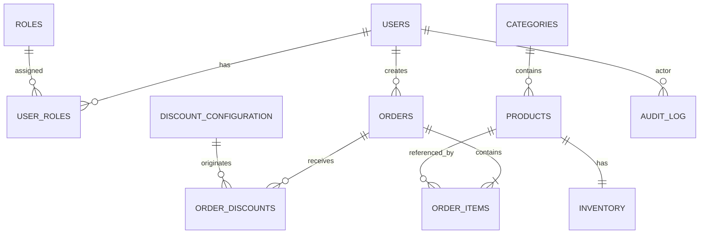
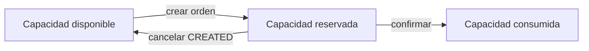
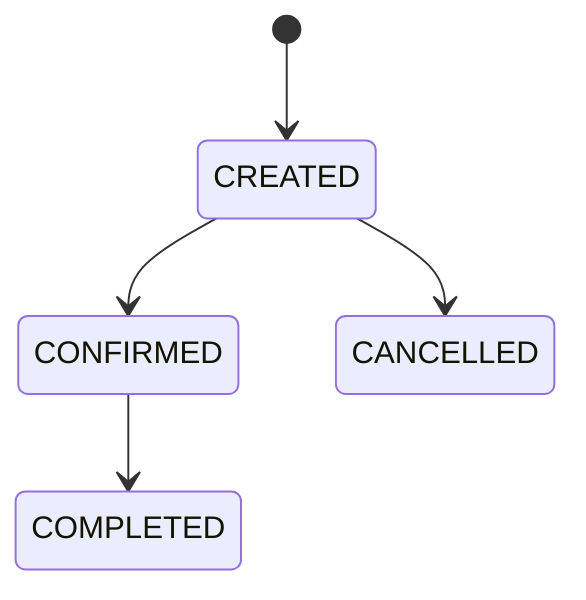

# LaunchForge — Modelo de datos

## 1. Principios

1. PostgreSQL es la fuente persistente de verdad.
2. Flyway controla la creación y evolución del esquema.
3. Hibernate solamente valida que el modelo JPA sea compatible con el esquema existente.
4. Los valores monetarios se almacenan como `NUMERIC`, nunca como `FLOAT` o `DOUBLE`.
5. Los precios históricos de una orden se preservan mediante snapshots en `order_items`.
6. El inventario no puede quedar con cantidades negativas.
7. Las órdenes mantienen consistencia transaccional.
8. Los descuentos aplicados quedan trazables.
9. Los reportes utilizan agregaciones sobre PostgreSQL.
10. La auditoría permite reconstruir acciones relevantes.
11. `JSONB` se utiliza únicamente para metadata flexible de auditoría.
12. Los roles se normalizan en tablas relacionales.
13. Las migraciones publicadas no se modifican; cualquier cambio posterior debe incorporarse mediante una nueva migración incremental.

## 2. Módulos

```text
Identity
Catalog
Inventory
Orders
Discounts
Audit
```

El esquema actual se construye mediante ocho migraciones:

```text
V1  Identity
V2  Catalog
V3  Inventory
V4  Orders
V5  Discounts
V6  Audit
V7  Indexes
V8  Initial catalog data
```

## 3. Diagrama lógico



## 4. Identity

El módulo de identidad se crea en `V1__create_identity.sql`.

### `users`

| Campo | Tipo | Regla |
|---|---|---|
| `id` | UUID | PK |
| `email` | VARCHAR(255) | UNIQUE, NOT NULL |
| `password_hash` | VARCHAR(255) | NOT NULL |
| `first_name` | VARCHAR(120) | NOT NULL |
| `last_name` | VARCHAR(120) | NOT NULL |
| `enabled` | BOOLEAN | NOT NULL, DEFAULT TRUE |
| `created_at` | TIMESTAMPTZ | NOT NULL |
| `updated_at` | TIMESTAMPTZ | NOT NULL |
| `created_by` | UUID | NULL |
| `updated_by` | UUID | NULL |

La contraseña no se almacena en texto plano; la tabla persiste únicamente `password_hash`.

### `roles`

| Campo | Tipo | Regla |
|---|---|---|
| `id` | SMALLSERIAL | PK |
| `name` | VARCHAR(50) | UNIQUE, NOT NULL |
| `description` | VARCHAR(255) | NULL |

Valores iniciales:

```text
ADMIN
CUSTOMER
```

Estos roles se insertan directamente en `V1`.

### `user_roles`

Relación N:M entre usuarios y roles.

| Campo | Tipo | Regla |
|---|---|---|
| `user_id` | UUID | FK users, NOT NULL |
| `role_id` | SMALLINT | FK roles, NOT NULL |

Clave primaria compuesta:

```text
(user_id, role_id)
```

El modelo permite que un usuario tenga uno o varios roles. La tabla `users` no contiene una columna `role`; la asignación se mantiene en `user_roles`.

---

## 5. Catalog

El catálogo se crea en `V2__create_catalog.sql`.

### `categories`

| Campo | Tipo | Regla |
|---|---|---|
| `id` | BIGSERIAL | PK |
| `name` | VARCHAR(120) | UNIQUE, NOT NULL |
| `slug` | VARCHAR(140) | UNIQUE, NOT NULL |
| `description` | VARCHAR(500) | NULL |
| `active` | BOOLEAN | NOT NULL, DEFAULT TRUE |
| `created_at` | TIMESTAMPTZ | NOT NULL |
| `updated_at` | TIMESTAMPTZ | NOT NULL |

### `products`

| Campo | Tipo | Regla |
|---|---|---|
| `id` | UUID | PK |
| `sku` | VARCHAR(50) | UNIQUE, NOT NULL |
| `name` | VARCHAR(180) | NOT NULL |
| `slug` | VARCHAR(200) | UNIQUE, NOT NULL |
| `description` | TEXT | NOT NULL |
| `category_id` | BIGINT | FK categories, NOT NULL |
| `price` | NUMERIC(19,2) | NOT NULL, >= 0 |
| `active` | BOOLEAN | NOT NULL, DEFAULT TRUE |
| `created_at` | TIMESTAMPTZ | NOT NULL |
| `updated_at` | TIMESTAMPTZ | NOT NULL |
| `created_by` | UUID | NULL |
| `updated_by` | UUID | NULL |

Restricción monetaria:

```sql
CHECK (price >= 0)
```

`stock` no pertenece a `products`; la capacidad disponible y reservada pertenece al módulo `inventory`.

---

## 6. Inventory

El inventario se crea en `V3__create_inventory.sql`.

### `inventory`

Relación:

```text
Product 1 ─── 1 Inventory
```

La relación uno a uno se garantiza mediante la restricción `UNIQUE` sobre `product_id`.

| Campo | Tipo | Regla |
|---|---|---|
| `id` | UUID | PK |
| `product_id` | UUID | FK products, UNIQUE, NOT NULL |
| `available_quantity` | INTEGER | NOT NULL, >= 0 |
| `reserved_quantity` | INTEGER | NOT NULL, >= 0 |
| `version` | BIGINT | NOT NULL, DEFAULT 0 |
| `updated_at` | TIMESTAMPTZ | NOT NULL |

Constraints:

```sql
CHECK (available_quantity >= 0)
CHECK (reserved_quantity >= 0)
```

`version` soporta el control de concurrencia optimista y se corresponde con el uso de `@Version` en JPA.

### Semántica del inventario



La capacidad se divide entre cantidad disponible y cantidad reservada para evitar vender más capacidad de la existente.

---

## 7. Estados de orden

Los estados permitidos se restringen desde la base de datos en `V4__create_orders.sql`.

```text
CREATED
CONFIRMED
CANCELLED
COMPLETED
```

El estado se persiste como texto mediante `VARCHAR(30)` y PostgreSQL valida los valores posibles con un `CHECK`.

Transiciones definidas por la lógica de negocio:



En la implementación actual no existe la transición:

```text
CONFIRMED -> CANCELLED
```

La base de datos restringe los valores válidos del estado; las transiciones entre estados corresponden a la lógica de aplicación.

---

## 8. Orders

Las tablas de órdenes se crean en `V4__create_orders.sql`.

### `orders`

| Campo | Tipo | Regla de base de datos |
|---|---|---|
| `id` | UUID | PK |
| `order_number` | VARCHAR(40) | UNIQUE, NOT NULL |
| `customer_id` | UUID | FK users, NOT NULL |
| `status` | VARCHAR(30) | NOT NULL, CHECK |
| `requirement_description` | TEXT | NULL |
| `project_objective` | TEXT | NULL |
| `contact_email` | VARCHAR(180) | NULL |
| `contact_phone` | VARCHAR(40) | NULL |
| `desired_delivery_date` | DATE | NULL |
| `references_url` | TEXT | NULL |
| `subtotal` | NUMERIC(19,2) | NOT NULL, >= 0 |
| `discount_total` | NUMERIC(19,2) | NOT NULL, >= 0 |
| `total` | NUMERIC(19,2) | NOT NULL, >= 0 |
| `idempotency_key` | VARCHAR(120) | NULL |
| `created_at` | TIMESTAMPTZ | NOT NULL |
| `updated_at` | TIMESTAMPTZ | NOT NULL |

Los campos de requerimiento se permiten como `NULL` en el esquema de PostgreSQL. Si determinados campos son obligatorios para una operación HTTP, esa obligatoriedad corresponde a la validación de la API y no a una restricción `NOT NULL` de la migración actual.

### Protecciones monetarias

```sql
CHECK (subtotal >= 0)
CHECK (discount_total >= 0)
CHECK (total >= 0)
CHECK (discount_total <= subtotal)
```

### Idempotencia

La base de datos crea un índice único parcial:

```text
(customer_id, idempotency_key)
```

únicamente cuando:

```sql
idempotency_key IS NOT NULL
```

Esto permite que varias órdenes no idempotentes tengan llave nula, pero evita repetir una misma llave para el mismo cliente.

---

## 9. Order items

### `order_items`

También se crea en `V4__create_orders.sql`.

| Campo | Tipo | Regla |
|---|---|---|
| `id` | UUID | PK |
| `order_id` | UUID | FK orders, NOT NULL |
| `product_id` | UUID | FK products, NOT NULL |
| `product_name` | VARCHAR(180) | NOT NULL |
| `sku` | VARCHAR(50) | NOT NULL |
| `quantity` | INTEGER | NOT NULL, > 0 |
| `unit_price` | NUMERIC(19,2) | NOT NULL, >= 0 |
| `subtotal` | NUMERIC(19,2) | NOT NULL, >= 0 |

Constraints:

```sql
CHECK (quantity > 0)
CHECK (unit_price >= 0)
CHECK (subtotal >= 0)
```

### Snapshot comercial

Los siguientes valores se copian desde el producto al momento de construir el item:

```text
product_name
sku
unit_price
```

Esto evita que una modificación posterior del catálogo altere el historial comercial de una orden ya creada.

---

## 10. Discount configuration

El módulo de descuentos se crea en `V5__create_discounts.sql`.

### `discount_configuration`

| Campo | Tipo | Regla |
|---|---|---|
| `id` | UUID | PK |
| `code` | VARCHAR(80) | UNIQUE, NOT NULL |
| `type` | VARCHAR(80) | NOT NULL |
| `enabled` | BOOLEAN | NOT NULL |
| `percentage` | NUMERIC(5,2) | NOT NULL, 0..100 |
| `start_at` | TIMESTAMPTZ | NULL |
| `end_at` | TIMESTAMPTZ | NULL |
| `minimum_orders` | INTEGER | NULL, > 0 si existe |
| `lookback_months` | INTEGER | NULL, > 0 si existe |
| `created_at` | TIMESTAMPTZ | NOT NULL |
| `updated_at` | TIMESTAMPTZ | NOT NULL |
| `updated_by` | UUID | NULL |

Constraints principales:

```sql
CHECK (percentage >= 0 AND percentage <= 100)
CHECK (minimum_orders IS NULL OR minimum_orders > 0)
CHECK (lookback_months IS NULL OR lookback_months > 0)
CHECK (
    start_at IS NULL
    OR end_at IS NULL
    OR start_at <= end_at
)
```

### Configuración inicial

`V5` registra tres reglas:

```text
TIME_RANGE          10%
RANDOM_ORDER        50%
FREQUENT_CUSTOMER    5%
```

Las tres configuraciones se insertan inicialmente con:

```text
enabled = false
```

De esta manera, su activación comercial debe realizarse de forma explícita.

Para `FREQUENT_CUSTOMER`, la configuración inicial es:

```text
minimum_orders = 5
lookback_months = 12
```

---

## 11. Order discounts

### `order_discounts`

También se crea en `V5__create_discounts.sql`.

| Campo | Tipo | Regla |
|---|---|---|
| `id` | UUID | PK |
| `order_id` | UUID | FK orders, NOT NULL |
| `discount_configuration_id` | UUID | FK discount_configuration, NULL |
| `code` | VARCHAR(80) | NOT NULL |
| `percentage` | NUMERIC(5,2) | NOT NULL, 0..100 |
| `amount` | NUMERIC(19,2) | NOT NULL, >= 0 |
| `base_amount` | NUMERIC(19,2) | NOT NULL, >= 0 |
| `reason` | VARCHAR(500) | NOT NULL |
| `application_order` | INTEGER | NOT NULL, > 0 |

Constraints:

```sql
CHECK (percentage >= 0 AND percentage <= 100)
CHECK (amount >= 0)
CHECK (base_amount >= 0)
CHECK (application_order > 0)
```

La persistencia permite reconstruir:

- qué regla de descuento se aplicó;
- qué porcentaje utilizó;
- cuál fue el monto base;
- cuánto se descontó;
- cuál fue la razón;
- en qué orden se registró.

### Regla de cálculo

Según la lógica documentada del sistema, cada descuento aplicable utiliza el subtotal original como base.

Ejemplo con subtotal `100`:

```text
TIME_RANGE          10% -> base 100 -> amount 10
RANDOM_ORDER        50% -> base 100 -> amount 50
FREQUENT_CUSTOMER    5% -> base 100 -> amount 5

discount_total = 65
total = 35
```

`application_order` conserva el orden de trazabilidad de las reglas aplicadas.

---

## 12. Frequent customer

No existe un campo booleano `frequent_customer` en `users`.

La elegibilidad se deriva de la información de las órdenes y de la configuración de descuentos.

La regla utiliza órdenes en estados comerciales válidos:

```text
CONFIRMED
COMPLETED
```

y toma como parámetros configurables:

```text
minimum_orders
lookback_months
```

La configuración inicial de `V5` establece:

```text
minimum_orders = 5
lookback_months = 12
```

Las órdenes `CREATED` y `CANCELLED` no deben considerarse ventas completadas para este cálculo.

---

## 13. Random order

La configuración `RANDOM_ORDER` se registra en `V5` con un porcentaje inicial del `50%` y queda deshabilitada por defecto.

La selección aleatoria pertenece a la lógica de aplicación; el esquema de base de datos conserva el resultado aplicado mediante `order_discounts`.

Esto permite que la decisión comercial aplicada a una orden quede registrada aun cuando la selección haya sido aleatoria.

---

## 14. Audit

El módulo de auditoría se crea en `V6__create_audit.sql`.

### `audit_log`

| Campo | Tipo | Regla |
|---|---|---|
| `id` | UUID | PK |
| `actor_user_id` | UUID | FK users, NULL |
| `action` | VARCHAR(100) | NOT NULL |
| `resource_type` | VARCHAR(100) | NOT NULL |
| `resource_id` | VARCHAR(100) | NULL |
| `correlation_id` | VARCHAR(100) | NULL |
| `ip_address` | VARCHAR(64) | NULL |
| `metadata` | JSONB | NULL |
| `created_at` | TIMESTAMPTZ | NOT NULL |

`actor_user_id` puede ser nulo para permitir registrar acciones donde no exista un usuario autenticado asociado.

`JSONB` se reserva para metadata variable y controlada.

La metadata de auditoría no debe utilizarse para persistir:

- contraseñas;
- `password_hash`;
- JWT;
- secretos;
- credenciales;
- payloads completos sin filtrar.

---

## 15. Eliminación de productos

La estructura del modelo permite mantener un producto mediante el atributo:

```text
active = false
```

La desactivación es la opción adecuada cuando existe historial comercial asociado al producto, ya que `order_items.product_id` mantiene una referencia al catálogo.

Además, `order_items` conserva snapshots de:

```text
product_name
sku
unit_price
```

para preservar la información comercial histórica.

La eliminación física de un producto está condicionada por sus relaciones y restricciones de clave foránea.

---

## 16. Reportes

Los reportes no requieren tablas adicionales en las migraciones actuales. Se obtienen mediante consultas y agregaciones sobre el modelo existente.

### Productos activos

Fuente:

```text
products
```

Filtro:

```text
active = true
```

### Top 5 productos vendidos

Fuentes principales:

```text
order_items
JOIN orders
JOIN products
```

Estados comerciales considerados:

```text
CONFIRMED
COMPLETED
```

Agregación principal:

```sql
SUM(order_items.quantity)
```

### Top 5 clientes

Fuentes principales:

```text
orders
JOIN users
```

Estados comerciales considerados:

```text
CONFIRMED
COMPLETED
```

Agregación principal:

```sql
COUNT(orders.id)
```

---

## 17. Constraints e índices

PostgreSQL funciona como última línea de defensa para restricciones de integridad que también puedan ser validadas por la aplicación.

### Restricciones de unicidad

Las migraciones `V1` a `V5` definen restricciones `UNIQUE` relevantes para:

- `users.email`;
- `roles.name`;
- `categories.name`;
- `categories.slug`;
- `products.sku`;
- `products.slug`;
- `inventory.product_id`;
- `orders.order_number`;
- `discount_configuration.code`.

Además, `V4` crea un índice único parcial para:

```text
(customer_id, idempotency_key)
```

cuando `idempotency_key` no es nulo.

### Índices explícitos de `V7`

`V7__create_indexes.sql` agrega índices para:

#### Products

```text
products(active)
products(category_id)
products(name)
products(price)
```

#### Inventory

```text
inventory(available_quantity)
```

#### Orders

```text
orders(customer_id)
orders(created_at)
orders(status)
orders(customer_id, created_at)
```

#### Order items

```text
order_items(order_id)
order_items(product_id)
```

#### Order discounts

```text
order_discounts(order_id)
order_discounts(code)
```

#### Audit

```text
audit_log(actor_user_id)
audit_log(action)
audit_log(created_at)
audit_log(resource_type, resource_id)
```

Antes de introducir índices adicionales debe medirse el comportamiento real de las consultas, por ejemplo mediante:

```sql
EXPLAIN (ANALYZE, BUFFERS)
```

---

## 18. Datos iniciales

`V8__seed_initial_catalog.sql` no modifica la estructura del esquema; carga datos iniciales para poder utilizar el catálogo.

### Categorías iniciales

```text
WEB
ECOMMERCE
SAAS
DESIGN
INTEGRATIONS
MAINTENANCE
```

Después de insertar las categorías, la secuencia de `categories.id` se sincroniza con el mayor identificador existente.

### Productos iniciales

`V8` registra diez productos iniciales distribuidos entre las categorías del catálogo.

Entre ellos se encuentran:

```text
Landing Page Launch
Corporate Website Pro
E-commerce Starter
Digital Catalog
SaaS MVP Forge
UX/UI Discovery
API Integration Pack
Monthly Maintenance
Analytics Dashboard
Business Automation
```

### Inventario inicial

Después de crear los productos, `V8` genera un registro de inventario para cada producto con:

```text
available_quantity = 10
reserved_quantity  = 0
version            = 0
```

---

## 19. Estrategia de migración

El modelo de datos actual corresponde al resultado acumulado de las migraciones:

```text
V1__create_identity.sql
V2__create_catalog.sql
V3__create_inventory.sql
V4__create_orders.sql
V5__create_discounts.sql
V6__create_audit.sql
V7__create_indexes.sql
V8__seed_initial_catalog.sql
```

Responsabilidad de cada una:

| Migración | Responsabilidad |
|---|---|
| `V1` | Usuarios, roles y relación usuario-rol |
| `V2` | Categorías y productos |
| `V3` | Inventario y control de versión |
| `V4` | Órdenes, items e idempotencia |
| `V5` | Configuración y trazabilidad de descuentos |
| `V6` | Auditoría |
| `V7` | Índices de consulta |
| `V8` | Categorías, productos e inventario inicial |

Flyway es el responsable exclusivo de evolucionar el esquema.

Hibernate debe utilizarse para validar la compatibilidad entre las entidades JPA y la base de datos, no para modificar automáticamente la estructura.

Por tanto:

```properties
spring.flyway.enabled=true
spring.jpa.hibernate.ddl-auto=validate
```

Las migraciones `V1` a `V8` constituyen la baseline publicada actual y no deben reescribirse después de haber sido compartidas.

El siguiente cambio estructural de la base de datos deberá incorporarse mediante:

```text
V9__descripcion_del_cambio.sql
```

y los cambios posteriores deberán continuar de forma incremental:

```text
V10__...
V11__...
...
```

De esta forma, una instalación nueva puede reconstruir el modelo completo ejecutando de manera ordenada:

```text
V1 -> V2 -> V3 -> V4 -> V5 -> V6 -> V7 -> V8
```
