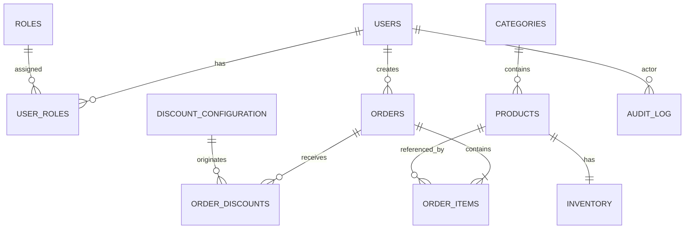
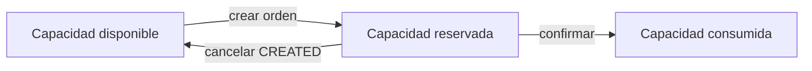
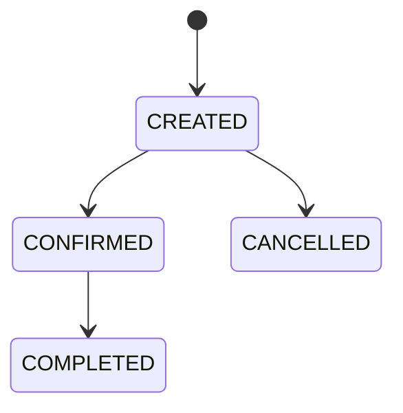

# LaunchForge — Modelo de datos

## 1. Principios

1. PostgreSQL es la fuente persistente de verdad.
2. Flyway controla la evolución del esquema.
3. Hibernate solamente valida el esquema.
4. Dinero se almacena como `NUMERIC`, nunca `FLOAT` o `DOUBLE`.
5. Los precios históricos de una orden se preservan.
6. Inventario no puede quedar negativo.
7. Las órdenes son consistentes transaccionalmente.
8. Los descuentos aplicados quedan trazables.
9. Los reportes usan agregaciones SQL.
10. La auditoría permite reconstruir acciones relevantes.
11. JSONB se utiliza únicamente para metadata flexible.
12. Los roles se normalizan en tablas relacionales.

## 2. Módulos

```text
Identity
Catalog
Inventory
Orders
Discounts
Audit
```

## 3. Diagrama lógico



## 4. Identity

### `users`

| Campo | Tipo | Regla |
|---|---|---|
| `id` | UUID | PK |
| `email` | VARCHAR(255) | UNIQUE, NOT NULL |
| `password_hash` | VARCHAR(255) | NOT NULL |
| `first_name` | VARCHAR(120) | NOT NULL |
| `last_name` | VARCHAR(120) | NOT NULL |
| `enabled` | BOOLEAN | NOT NULL |
| `created_at` | TIMESTAMPTZ | NOT NULL |
| `updated_at` | TIMESTAMPTZ | NOT NULL |
| `created_by` | UUID | NULL |
| `updated_by` | UUID | NULL |

No se almacena contraseña en texto plano.

### `roles`

| Campo | Tipo |
|---|---|
| `id` | SMALLSERIAL |
| `name` | VARCHAR(50) UNIQUE |
| `description` | VARCHAR(255) |

Valores base:

```text
ADMIN
CUSTOMER
```

### `user_roles`

Relación N:M.

| Campo | Tipo |
|---|---|
| `user_id` | UUID |
| `role_id` | SMALLINT |

PK:

```text
(user_id, role_id)
```

El registro normal asigna `CUSTOMER`. La promoción inicial a `ADMIN` modifica esta relación; `users` no contiene una columna `role`.

## 5. Catalog

### `categories`

| Campo | Tipo |
|---|---|
| `id` | BIGSERIAL |
| `name` | VARCHAR(120) |
| `slug` | VARCHAR(140) |
| `description` | VARCHAR(500) |
| `active` | BOOLEAN |
| `created_at` | TIMESTAMPTZ |
| `updated_at` | TIMESTAMPTZ |

### `products`

| Campo | Tipo | Regla |
|---|---|---|
| `id` | UUID | PK |
| `sku` | VARCHAR(50) | UNIQUE |
| `name` | VARCHAR(180) | NOT NULL |
| `slug` | VARCHAR(200) | UNIQUE |
| `description` | TEXT | NOT NULL |
| `category_id` | BIGINT | FK |
| `price` | NUMERIC(19,2) | >= 0 |
| `active` | BOOLEAN | DEFAULT true |
| auditoría técnica | varios | timestamps/actor |

`stock` no pertenece a `products`; la capacidad pertenece a `inventory`.

## 6. Inventory

### `inventory`

```text
Product 1 ─── 1 Inventory
```

| Campo | Tipo |
|---|---|
| `id` | UUID |
| `product_id` | UUID UNIQUE |
| `available_quantity` | INTEGER |
| `reserved_quantity` | INTEGER |
| `version` | BIGINT |
| `updated_at` | TIMESTAMPTZ |

Constraints:

```sql
CHECK (available_quantity >= 0)
CHECK (reserved_quantity >= 0)
```

`version` se mapea con `@Version`.

### Semántica



La capacidad operativa visible antes de una venta se reparte entre disponible y reservada.

## 7. Order status

```text
CREATED
CONFIRMED
CANCELLED
COMPLETED
```

Se persiste como texto, no como ordinal.

Transiciones:



No existe transición `CONFIRMED -> CANCELLED` en la implementación actual.

## 8. Orders

### `orders`

| Campo | Tipo | Regla |
|---|---|---|
| `id` | UUID | PK |
| `order_number` | VARCHAR(40) | UNIQUE |
| `customer_id` | UUID | FK users |
| `status` | VARCHAR(30) | NOT NULL |
| `subtotal` | NUMERIC(19,2) | >= 0 |
| `discount_total` | NUMERIC(19,2) | >= 0 |
| `total` | NUMERIC(19,2) | >= 0 |
| `idempotency_key` | VARCHAR(120) | NULL |
| `requirement_description` | TEXT | requerido por API |
| `project_objective` | TEXT | requerido por API |
| `contact_email` | VARCHAR(180) | requerido por API |
| `contact_phone` | VARCHAR(40) | opcional |
| `desired_delivery_date` | DATE | opcional |
| `references_url` | TEXT | opcional |
| `created_at` | TIMESTAMPTZ | NOT NULL |
| `updated_at` | TIMESTAMPTZ | NOT NULL |

Protecciones monetarias:

```sql
CHECK (subtotal >= 0)
CHECK (discount_total >= 0)
CHECK (total >= 0)
CHECK (discount_total <= subtotal)
```

Idempotencia:

```text
(customer_id, idempotency_key) UNIQUE
```

cuando la llave no es nula.

## 9. Order items

### `order_items`

| Campo | Tipo |
|---|---|
| `id` | UUID |
| `order_id` | UUID |
| `product_id` | UUID |
| `product_name` | VARCHAR(180) |
| `sku` | VARCHAR(50) |
| `quantity` | INTEGER |
| `unit_price` | NUMERIC(19,2) |
| `subtotal` | NUMERIC(19,2) |

Snapshot comercial:

```text
product_name
sku
unit_price
```

se copian en el item para que una modificación futura del catálogo no altere el historial de la orden.

## 10. Discount configuration

### `discount_configuration`

| Campo | Tipo |
|---|---|
| `id` | UUID |
| `code` | VARCHAR(80) UNIQUE |
| `type` | VARCHAR(80) |
| `enabled` | BOOLEAN |
| `percentage` | NUMERIC(5,2) |
| `start_at` | TIMESTAMPTZ NULL |
| `end_at` | TIMESTAMPTZ NULL |
| `minimum_orders` | INTEGER NULL |
| `lookback_months` | INTEGER NULL |
| `created_at` | TIMESTAMPTZ |
| `updated_at` | TIMESTAMPTZ |
| `updated_by` | UUID NULL |

Reglas actuales:

```text
TIME_RANGE       10%
RANDOM_ORDER     50%
FREQUENT_CUSTOMER 5%
```

`V15` las deja deshabilitadas inicialmente para que la configuración comercial sea explícita.

## 11. Order discounts

### `order_discounts`

| Campo | Tipo |
|---|---|
| `id` | UUID |
| `order_id` | UUID |
| `discount_configuration_id` | UUID NULL |
| `code` | VARCHAR(80) |
| `percentage` | NUMERIC(5,2) |
| `amount` | NUMERIC(19,2) |
| `base_amount` | NUMERIC(19,2) |
| `reason` | VARCHAR(500) |
| `application_order` | INTEGER |

La persistencia detallada permite responder:

- qué regla aplicó;
- qué porcentaje;
- sobre qué base;
- cuánto descontó;
- en qué orden se explicó.

### Regla de cálculo

Cada descuento aplicable utiliza el **subtotal original** como base.

Ejemplo subtotal `100`:

```text
TIME_RANGE        10% -> base 100 -> amount 10
RANDOM_ORDER      50% -> base 100 -> amount 50
FREQUENT_CUSTOMER  5% -> base 100 -> amount 5

discount_total = 65
total = 35
```

`application_order` conserva el orden de trazabilidad, no una base decreciente.

## 12. Frequent customer

No se almacena un booleano derivado en `users`.

La elegibilidad se calcula desde órdenes:

```text
status IN (CONFIRMED, COMPLETED)
created_at dentro de lookback
COUNT >= minimum_orders
```

Configuración base:

```text
minimum_orders = 5
lookback_months = 12
```

`CREATED` y `CANCELLED` no cuentan.

## 13. Random order

La selección usa un `RandomProvider` inyectable.

Esto permite:

- implementación real en producción;
- comportamiento determinista en pruebas.

El resultado aplicado queda registrado en `order_discounts`.

## 14. Audit

### `audit_log`

| Campo | Tipo |
|---|---|
| `id` | UUID |
| `actor_user_id` | UUID NULL |
| `action` | VARCHAR(100) |
| `resource_type` | VARCHAR(100) |
| `resource_id` | VARCHAR(100) NULL |
| `correlation_id` | VARCHAR(100) NULL |
| `ip_address` | VARCHAR(64) NULL |
| `metadata` | JSONB NULL |
| `created_at` | TIMESTAMPTZ |

JSONB se utiliza únicamente para metadata variable y controlada.

Nunca debe almacenar:

- password;
- `password_hash`;
- JWT;
- secretos;
- payloads completos sin filtrar.

## 15. Eliminación de productos

Se prioriza desactivación de negocio:

```text
active = false
```

cuando el producto tiene historial comercial.

Un producto nunca utilizado puede eliminarse físicamente si la implementación y las FK lo permiten.

## 16. Reportes

### Productos activos

Fuente:

```text
products
```

Filtro:

```text
active = true
```

### Top 5 productos vendidos

```text
order_items
JOIN orders
JOIN products
```

Estados válidos:

```text
CONFIRMED
COMPLETED
```

Agregación:

```sql
SUM(order_items.quantity)
```

### Top 5 clientes

```text
orders
JOIN users
```

Estados válidos:

```text
CONFIRMED
COMPLETED
```

Agregación:

```sql
COUNT(orders.id)
```

## 17. Constraints e índices

La aplicación valida primero y PostgreSQL funciona como última línea de defensa.

Índices relevantes cubren:

- email;
- SKU/slug;
- activo/categoría/nombre/precio;
- disponibilidad;
- customer/status/fecha de órdenes;
- items;
- descuentos;
- auditoría.

Para cambios futuros se debe medir con `EXPLAIN (ANALYZE, BUFFERS)` antes de introducir índices adicionales.

## 18. Estrategia de migración

El modelo final corresponde al resultado acumulado de `V1` a `V16`.

Las migraciones no se reescriben después de compartirse. El siguiente cambio de esquema debe introducir una nueva migración.
