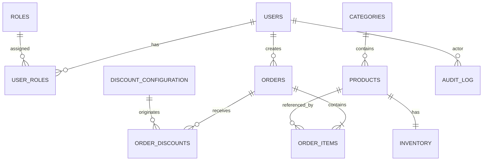

# LaunchForge — Modelo de datos y estrategia de migraciones

## 1. Objetivo

Este documento define el modelo de datos base de LaunchForge antes de iniciar la implementación.

Debe ser la referencia para:

- entidades JPA;
- migraciones Flyway;
- DTOs;
- repositorios;
- reportes;
- pruebas de integración;
- documentación de arquitectura;
- debugging;
- sustentación técnica.

Regla principal:

> El modelo no debe crecer por comodidad del framework. Cada tabla debe representar una necesidad real del dominio.

---

# 2. Principios de modelado

Se aplican los siguientes principios:

1. PostgreSQL es la fuente persistente de verdad.
2. Flyway controla la evolución del esquema.
3. Hibernate solamente valida el esquema.
4. Dinero se almacena como `NUMERIC`, nunca `FLOAT` o `DOUBLE`.
5. Los precios históricos de una orden se preservan.
6. Inventario no puede quedar negativo.
7. Las órdenes son consistentes transaccionalmente.
8. Los descuentos aplicados deben quedar trazables.
9. Los reportes deben resolverse mediante agregaciones SQL.
10. Los datos auditables deben poder reconstruir quién hizo qué.
11. No utilizar JSON como reemplazo de un modelo relacional cuando existe estructura conocida.
12. JSONB solo se utilizará para metadata realmente flexible.

---

# 3. Módulos del dominio

El modelo se divide en:

```text
Identity
Catalog
Inventory
Orders
Discounts
Audit
```

Relación conceptual:

```text
User
  │
  ├── Role
  │
  └── Order
        │
        ├── OrderItem ─── Product ─── Category
        │                     │
        │                     └── Inventory
        │
        └── OrderDiscount ─── DiscountConfiguration
```

---

# 4. Diagrama lógico



---

# 5. Identity

## 5.1 users

Propósito:

Representa usuarios autenticables de la plataforma.

Campos:

| Campo | Tipo | Regla |
|---|---|---|
| id | UUID | PK |
| email | VARCHAR(255) | UNIQUE, NOT NULL |
| password_hash | VARCHAR(255) | NOT NULL |
| first_name | VARCHAR(120) | NOT NULL |
| last_name | VARCHAR(120) | NOT NULL |
| enabled | BOOLEAN | NOT NULL DEFAULT true |
| created_at | TIMESTAMPTZ | NOT NULL |
| updated_at | TIMESTAMPTZ | NOT NULL |
| created_by | UUID | NULL |
| updated_by | UUID | NULL |

Decisión:

Usar UUID para usuarios y recursos públicos reduce dependencia de IDs secuenciales expuestos externamente.

No almacenar:

```text
password
plain_password
```

---

## 5.2 roles

Campos:

| Campo | Tipo |
|---|---|
| id | SMALLSERIAL |
| name | VARCHAR(50) UNIQUE |
| description | VARCHAR(255) |

Valores iniciales:

```text
ADMIN
CUSTOMER
```

Posible extensión futura:

```text
AUDITOR
MANAGER
```

---

## 5.3 user_roles

Tabla N:M.

Campos:

| Campo | Tipo |
|---|---|
| user_id | UUID |
| role_id | SMALLINT |

PK compuesta:

```text
(user_id, role_id)
```

No guardar roles como texto separado por comas dentro de `users`.

---

# 6. Catálogo

## 6.1 categories

Campos:

| Campo | Tipo |
|---|---|
| id | BIGSERIAL |
| name | VARCHAR(120) UNIQUE |
| slug | VARCHAR(140) UNIQUE |
| description | VARCHAR(500) |
| active | BOOLEAN |
| created_at | TIMESTAMPTZ |
| updated_at | TIMESTAMPTZ |

Ejemplos:

```text
WEB
ECOMMERCE
SAAS
DESIGN
INTEGRATIONS
MAINTENANCE
```

---

## 6.2 products

Representa servicios/paquetes vendibles.

Campos:

| Campo | Tipo | Regla |
|---|---|---|
| id | UUID | PK |
| sku | VARCHAR(50) | UNIQUE |
| name | VARCHAR(180) | NOT NULL |
| slug | VARCHAR(200) | UNIQUE |
| description | TEXT | NOT NULL |
| category_id | BIGINT | FK |
| price | NUMERIC(19,2) | >= 0 |
| active | BOOLEAN | DEFAULT true |
| created_at | TIMESTAMPTZ | NOT NULL |
| updated_at | TIMESTAMPTZ | NOT NULL |
| created_by | UUID | NULL |
| updated_by | UUID | NULL |

Constraint:

```sql
CHECK (price >= 0)
```

No almacenar:

```text
stock
```

dentro de esta tabla.

La responsabilidad de stock/capacidad pertenece a `inventory`.

---

# 7. Inventario

## 7.1 inventory

En LaunchForge el inventario representa capacidad operativa disponible.

Relación:

```text
Product 1 ─── 1 Inventory
```

Campos:

| Campo | Tipo |
|---|---|
| id | UUID |
| product_id | UUID UNIQUE |
| available_quantity | INTEGER |
| reserved_quantity | INTEGER |
| version | BIGINT |
| updated_at | TIMESTAMPTZ |

Constraints:

```sql
CHECK (available_quantity >= 0)
CHECK (reserved_quantity >= 0)
```

`version` se utiliza para optimistic locking.

Entidad JPA:

```java
@Version
private Long version;
```

---

# 8. Estados de orden

Usar enum persistido como texto:

```text
CREATED
CONFIRMED
CANCELLED
COMPLETED
```

No usar ordinal del enum.

Motivo:

Cambiar el orden del enum en Java no debe alterar el significado almacenado.

---

# 9. Orders

## 9.1 orders

Campos:

| Campo | Tipo | Regla |
|---|---|---|
| id | UUID | PK |
| order_number | VARCHAR(40) | UNIQUE |
| customer_id | UUID | FK users |
| status | VARCHAR(30) | NOT NULL |
| subtotal | NUMERIC(19,2) | >= 0 |
| discount_total | NUMERIC(19,2) | >= 0 |
| total | NUMERIC(19,2) | >= 0 |
| idempotency_key | VARCHAR(120) | NULL |
| created_at | TIMESTAMPTZ | NOT NULL |
| updated_at | TIMESTAMPTZ | NOT NULL |

Constraints:

```sql
CHECK (subtotal >= 0)
CHECK (discount_total >= 0)
CHECK (total >= 0)
CHECK (discount_total <= subtotal)
```

Índice/constraint importante:

```text
(customer_id, idempotency_key) UNIQUE
```

cuando `idempotency_key` no es NULL.

En PostgreSQL puede resolverse mediante índice parcial.

---

# 10. Order Items

## 10.1 order_items

Campos:

| Campo | Tipo |
|---|---|
| id | UUID |
| order_id | UUID |
| product_id | UUID |
| product_name | VARCHAR(180) |
| sku | VARCHAR(50) |
| quantity | INTEGER |
| unit_price | NUMERIC(19,2) |
| subtotal | NUMERIC(19,2) |

Constraints:

```sql
CHECK (quantity > 0)
CHECK (unit_price >= 0)
CHECK (subtotal >= 0)
```

## Por qué duplicar product_name y sku

La orden debe conservar un snapshot comercial mínimo.

Si posteriormente:

```text
"E-commerce Basic"
```

cambia a:

```text
"E-commerce Starter"
```

la orden histórica debe seguir mostrando lo comprado originalmente.

No depender únicamente del nombre actual del producto.

---

# 11. Descuentos

## 11.1 discount_configuration

Representa reglas configurables de descuento.

Campos:

| Campo | Tipo |
|---|---|
| id | UUID |
| code | VARCHAR(80) UNIQUE |
| type | VARCHAR(80) |
| enabled | BOOLEAN |
| percentage | NUMERIC(5,2) |
| start_at | TIMESTAMPTZ NULL |
| end_at | TIMESTAMPTZ NULL |
| minimum_orders | INTEGER NULL |
| lookback_months | INTEGER NULL |
| created_at | TIMESTAMPTZ |
| updated_at | TIMESTAMPTZ |
| updated_by | UUID NULL |

Valores seed:

```text
TIME_RANGE
RANDOM_ORDER
FREQUENT_CUSTOMER
```

Ejemplo:

```text
TIME_RANGE
percentage = 10
enabled = true

RANDOM_ORDER
percentage = 50
enabled = true

FREQUENT_CUSTOMER
percentage = 5
minimum_orders = 5
lookback_months = 12
```

---

# 12. order_discounts

Toda regla aplicada debe quedar registrada.

Campos:

| Campo | Tipo |
|---|---|
| id | UUID |
| order_id | UUID |
| discount_configuration_id | UUID NULL |
| code | VARCHAR(80) |
| percentage | NUMERIC(5,2) |
| amount | NUMERIC(19,2) |
| base_amount | NUMERIC(19,2) |
| reason | VARCHAR(500) |
| application_order | INTEGER |

Ejemplo:

```text
TIME_RANGE
10%
base 100.00
amount 10.00
application_order 1
```

Luego:

```text
RANDOM_ORDER
50%
base 90.00
amount 45.00
application_order 2
```

Esto permite reconstruir exactamente el cálculo.

---

# 13. Por qué no guardar descuentos únicamente como discount_total

Guardar solo:

```text
discount_total
```

impide responder:

```text
¿Qué descuentos aplicaron?
¿En qué orden?
¿Sobre qué base?
¿Por qué?
```

Por eso:

```text
orders.discount_total
```

es el agregado rápido, mientras:

```text
order_discounts
```

preserva trazabilidad.

---

# 14. Cliente frecuente

No crear inicialmente una columna:

```text
users.frequent_customer
```

porque se volvería dato derivado susceptible de quedar desactualizado.

La regla debe calcularse mediante órdenes históricas.

Definición inicial:

```text
>= 5 órdenes CONFIRMED o COMPLETED
durante los últimos 12 meses
```

Estos valores provienen de:

```text
discount_configuration
```

y no del código hardcodeado.

---

# 15. Pedido aleatorio

No almacenar un booleano arbitrario en `orders` como fuente de decisión.

El resultado sí puede quedar reflejado mediante:

```text
order_discounts.code = RANDOM_ORDER
```

La selección debe ocurrir mediante:

```text
RandomProvider
```

inyectable.

Así los tests son deterministas.

---

# 16. Auditoría

## 16.1 audit_log

Campos:

| Campo | Tipo |
|---|---|
| id | UUID |
| actor_user_id | UUID NULL |
| action | VARCHAR(100) |
| resource_type | VARCHAR(100) |
| resource_id | VARCHAR(100) NULL |
| correlation_id | VARCHAR(100) NULL |
| ip_address | VARCHAR(64) NULL |
| metadata | JSONB NULL |
| created_at | TIMESTAMPTZ |

Ejemplos de `action`:

```text
USER_ROLE_CHANGED
PRODUCT_CREATED
PRODUCT_UPDATED
PRODUCT_DELETED
INVENTORY_ADJUSTED
ORDER_CREATED
ORDER_CANCELLED
DISCOUNT_CONFIGURATION_UPDATED
```

JSONB se permite aquí porque `metadata` puede variar según el evento.

No utilizar metadata JSONB para reemplazar columnas fundamentales.

---

# 17. ¿Tabla separada para idempotency?

Para este challenge se prefiere inicialmente:

```text
orders.idempotency_key
```

con índice único parcial:

```text
(customer_id, idempotency_key)
```

Ventajas:

```text
menos tablas
regla simple
suficiente para creación de órdenes
```

Crear tabla separada `idempotency_request` solo si se requiere:

```text
almacenar respuesta completa
TTL
estado PROCESSING/COMPLETED
idempotencia para múltiples operaciones
```

No sobrearquitecturar inicialmente.

---

# 18. Eliminación de productos

Preferir:

```text
soft business deletion
```

mediante:

```text
active = false
```

para productos que ya poseen órdenes.

No eliminar físicamente productos referenciados por historial comercial.

El endpoint DELETE puede implementar una desactivación de negocio documentada.

Si se decide soportar borrado físico, solamente para productos nunca utilizados.

---

# 19. Cancelación de órdenes

Cancelar una orden NO significa borrarla.

Cambio:

```text
CONFIRMED → CANCELLED
```

Debe conservarse:

```text
order
order_items
order_discounts
```

y devolver capacidad al inventario si el flujo de negocio ya la había consumido.

La operación debe ser transaccional.

---

# 20. Historial de estado de orden

Para el challenge base NO es obligatorio crear:

```text
order_status_history
```

porque `audit_log` puede cubrir eventos de cambio de estado.

Crear tabla dedicada solamente si posteriormente se requiere:

```text
timeline funcional
SLA
duración por estado
reportes de transición
```

Evitar duplicación prematura.

---

# 21. Constraints críticas

Además de validaciones Java, PostgreSQL debe proteger invariantes básicas.

Ejemplos:

```sql
CHECK (price >= 0)
CHECK (available_quantity >= 0)
CHECK (reserved_quantity >= 0)
CHECK (quantity > 0)
CHECK (subtotal >= 0)
CHECK (discount_total >= 0)
CHECK (total >= 0)
```

La aplicación valida primero.

La DB actúa como última línea de defensa.

---

# 22. Índices mínimos

## users

```text
UNIQUE(email)
```

## products

```text
UNIQUE(sku)
UNIQUE(slug)
INDEX(active)
INDEX(category_id)
INDEX(name)
INDEX(price)
```

Para búsqueda parcial por nombre se puede evaluar `pg_trgm` únicamente si se justifica.

No agregar extensión inicialmente si `ILIKE` es suficiente para el challenge.

## inventory

```text
UNIQUE(product_id)
INDEX(available_quantity)
```

## orders

```text
UNIQUE(order_number)
INDEX(customer_id)
INDEX(created_at)
INDEX(status)
INDEX(customer_id, created_at)
```

## order_items

```text
INDEX(order_id)
INDEX(product_id)
```

## order_discounts

```text
INDEX(order_id)
INDEX(code)
```

## audit_log

```text
INDEX(actor_user_id)
INDEX(action)
INDEX(created_at)
INDEX(resource_type, resource_id)
```

---

# 23. Reportes y soporte del modelo

## Productos activos

Fuente:

```text
products
```

Filtro:

```text
active = true
```

---

## Top 5 productos vendidos

Fuente:

```text
order_items
JOIN orders
JOIN products
```

Considerar únicamente:

```text
CONFIRMED
COMPLETED
```

Agregación:

```sql
SUM(order_items.quantity)
```

---

## Top 5 clientes frecuentes

Fuente:

```text
orders
JOIN users
```

Considerar:

```text
CONFIRMED
COMPLETED
```

Agregación:

```sql
COUNT(orders.id)
```

---

# 24. Regla sobre órdenes canceladas

Las órdenes:

```text
CANCELLED
```

NO deben contar para:

```text
Top 5 productos vendidos
Top 5 clientes frecuentes
FrequentCustomerDiscountStrategy
```

Documentar esta decisión.

---

# 25. Búsqueda de productos

Filtros soportados:

```text
name
sku
category
minPrice
maxPrice
active
available
```

No crear tablas adicionales para búsqueda.

Implementar mediante:

```text
Specification
Criteria API
```

o mecanismo equivalente.

---

# 26. Optimistic locking

El campo:

```text
inventory.version
```

debe mapear:

```java
@Version
```

Flujo:

```text
TX A lee version = 5
TX B lee version = 5

TX A actualiza
version = 6

TX B intenta actualizar version = 5
0 rows affected
OptimisticLockingFailure
```

La aplicación debe convertir el conflicto esperado a:

```text
HTTP 409 CONFLICT
```

cuando corresponda.

---

# 27. Frontera transaccional de CreateOrder

Conceptualmente:

```text
BEGIN

validar usuario
cargar productos
validar inventario
actualizar inventario
crear order
crear order_items
calcular descuentos
crear order_discounts
actualizar totales

COMMIT
```

Ante excepción:

```text
ROLLBACK
```

No distribuir este flujo en transacciones independientes sin justificación.

---

# 28. Frontera transaccional de CancelOrder

Conceptualmente:

```text
BEGIN

cargar order
validar estado
marcar CANCELLED
devolver inventario
auditar

COMMIT
```

Ante error:

```text
ROLLBACK
```

---

# 29. Dinero

PostgreSQL:

```text
NUMERIC(19,2)
```

Java:

```text
BigDecimal
```

Regla de redondeo:

```text
RoundingMode.HALF_UP
```

No realizar aritmética monetaria con:

```text
double
float
```

---

# 30. Timestamps

Utilizar:

```text
TIMESTAMPTZ
```

en PostgreSQL.

Java:

```text
Instant
```

o:

```text
OffsetDateTime
```

de manera consistente.

Preferencia:

```text
Instant en backend
UTC en persistencia
```

Frontend convierte a zona local para presentación.

---

# 31. UUID

Preferir UUID generado por aplicación o PostgreSQL, pero elegir una sola estrategia.

Recomendación:

```text
UUID generado en Java
```

para no depender de extensiones PostgreSQL únicamente para IDs.

No mezclar UUID y BIGINT sin criterio.

Excepciones aceptables:

```text
roles
categories
```

pueden utilizar IDs pequeños/secuenciales porque son catálogos internos.

---

# 32. Migraciones definitivas iniciales

## V1__create_identity.sql

Crear:

```text
users
roles
user_roles
```

Seed estructural:

```text
ADMIN
CUSTOMER
```

---

## V2__create_catalog.sql

Crear:

```text
categories
products
```

Seed estructural de categorías.

---

## V3__create_inventory.sql

Crear:

```text
inventory
```

Incluye:

```text
version
constraints
```

---

## V4__create_orders.sql

Crear:

```text
orders
order_items
```

Incluir índice parcial para idempotencia.

---

## V5__create_discounts.sql

Crear:

```text
discount_configuration
order_discounts
```

Seed estructural:

```text
TIME_RANGE
RANDOM_ORDER
FREQUENT_CUSTOMER
```

---

## V6__create_audit.sql

Crear:

```text
audit_log
```

---

## V7__create_indexes.sql

Agregar índices de rendimiento no cubiertos por UNIQUE/PK.

---

## V8__seed_demo_data.sql

Crear datos demo reproducibles.

---

# 33. Seed demo esperado

## Usuarios

```text
admin@launchforge.dev
customer@launchforge.dev
frequent@launchforge.dev
client1@launchforge.dev
client2@launchforge.dev
client3@launchforge.dev
client4@launchforge.dev
client5@launchforge.dev
```

---

## Productos

```text
LF-WEB-001 Landing Page
LF-WEB-002 Web Corporativa
LF-ECO-001 E-commerce
LF-SAA-001 MVP SaaS
LF-SEO-001 SEO Inicial
LF-UX-001 UI/UX Pack
LF-INT-001 Integración WhatsApp
LF-MNT-001 Mantenimiento
```

---

## Inventario

Ejemplo:

```text
Landing Page               8
Web Corporativa            5
E-commerce                 3
MVP SaaS                   2
SEO Inicial               10
UI/UX Pack                 6
Integración WhatsApp      10
Mantenimiento             20
```

---

## Órdenes históricas

Crear suficientes órdenes para que:

```text
frequent@launchforge.dev
```

cumpla:

```text
>= 5 órdenes CONFIRMED/COMPLETED en 12 meses
```

Crear distribución suficiente para mostrar:

```text
Top 5 productos
Top 5 clientes
```

No crear órdenes al azar durante startup.

El seed debe ser determinista.

---

# 34. Descuentos demo

Configurar inicialmente:

```text
TIME_RANGE
10%

RANDOM_ORDER
50%

FREQUENT_CUSTOMER
5%
```

La ventana temporal demo debe poder parametrizarse sin recompilar.

Para evitar que la demo caduque, NO es buena idea dejar una fecha fija cercana dentro del seed definitivo.

Opciones aceptables:

1. endpoint/admin UI para actualizar rango;
2. migración seed con ventana amplia claramente documentada;
3. configuración inicial modificable antes de demo.

Preferencia:

```text
crear configuración y permitir editarla desde admin
```

---

# 35. Auditoría y datos personales

No guardar en `audit_log.metadata`:

```text
password
password_hash
JWT
secret
```

Metadata permitida:

```json
{
  "previousStatus": "ACTIVE",
  "newStatus": "INACTIVE"
}
```

o:

```json
{
  "previousQuantity": 3,
  "newQuantity": 5
}
```

---

# 36. Integridad referencial

Política general:

```text
ON DELETE RESTRICT
```

para datos de negocio históricos.

Ejemplos:

```text
Product usado en OrderItem → no borrar físicamente
User con Orders → no borrar físicamente
```

Para relaciones auxiliares:

```text
user_roles
```

puede utilizarse:

```text
ON DELETE CASCADE
```

cuando eliminar la asociación sea correcto.

---

# 37. Borrado de usuarios

No borrar físicamente usuarios con historial.

Usar:

```text
enabled = false
```

como desactivación.

Motivos:

```text
órdenes históricas
auditoría
integridad
```

---

# 38. Qué NO modelar todavía

No crear inicialmente:

```text
payments
invoices
shipping
addresses
suppliers
coupons
shopping_cart persistence
notifications
event_store
outbox
sagas
```

porque el challenge no lo exige.

El carrito puede ser estado frontend hasta checkout.

Agregar nuevas tablas únicamente ante requisito concreto.

---

# 39. Decisiones de modelado críticas

El proyecto adopta estas decisiones y su justificación debe permanecer explícita:

```text
¿Por qué OrderItem guarda unit_price?
¿Por qué OrderDiscount existe además de discount_total?
¿Por qué FrequentCustomer no es boolean en users?
¿Por qué inventory está separado de products?
¿Por qué inventory tiene @Version?
¿Por qué CANCELLED no borra la orden?
¿Por qué productos se desactivan en vez de eliminarse?
¿Por qué UUID en recursos principales?
¿Por qué NUMERIC y BigDecimal?
¿Por qué TIMESTAMPTZ?
¿Por qué Flyway controla schema?
¿Por qué Hibernate solo valida?
```

---

# 40. Queries de diagnóstico obligatorias

## Ver inventario

```sql
SELECT
    p.sku,
    p.name,
    i.available_quantity,
    i.reserved_quantity,
    i.version
FROM inventory i
JOIN products p ON p.id = i.product_id
ORDER BY p.name;
```

## Ver últimas órdenes

```sql
SELECT
    order_number,
    customer_id,
    status,
    subtotal,
    discount_total,
    total,
    created_at
FROM orders
ORDER BY created_at DESC
LIMIT 20;
```

## Ver descuentos de una orden

```sql
SELECT
    code,
    percentage,
    base_amount,
    amount,
    application_order,
    reason
FROM order_discounts
WHERE order_id = :order_id
ORDER BY application_order;
```

## Ver clientes frecuentes

```sql
SELECT
    customer_id,
    COUNT(*) AS valid_orders
FROM orders
WHERE status IN ('CONFIRMED', 'COMPLETED')
  AND created_at >= NOW() - INTERVAL '12 months'
GROUP BY customer_id
ORDER BY valid_orders DESC;
```

---

# 41. Definition of Done del modelo

El modelo se considera estable para iniciar desarrollo cuando:

```text
tablas definidas
PK definidas
FK definidas
constraints definidas
índices definidos
estados definidos
reglas de borrado definidas
modelo soporta reportes
modelo soporta descuentos
modelo soporta auditoría
modelo soporta concurrencia
modelo soporta idempotencia
migraciones mapeadas
seed planificado
```

---

# 42. Regla de cambio del modelo

Antes de crear o modificar una entidad JPA, migración o repository:

1. revisar este documento;
2. verificar si la tabla/campo ya está definido;
3. no agregar columnas por conveniencia sin documentarlo;
4. si se requiere cambiar el modelo:
   - explicar la necesidad;
   - actualizar este documento;
   - crear nueva migración;
   - actualizar tests;
   - actualizar documentación de feature.

No modificar silenciosamente el modelo.
