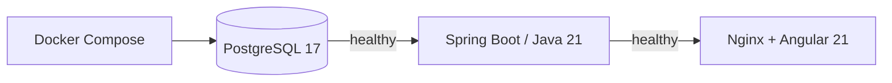

# Feature: bootstrap e infraestructura

## Qué problema resuelve

Entrega un entorno reproducible para ejecutar LaunchForge.

## Flujo



## Archivos principales

- `docker-compose.yml`
- `.env.example`
- `Makefile`
- `backend/Dockerfile`
- `frontend/Dockerfile`
- configuración Nginx
- configuración Spring Boot

## Puertos con `.env.example`

```text
Frontend:   8088
Backend:    8080
PostgreSQL: 55432
```

Dentro de la red Compose:

```text
backend -> db:5432
nginx   -> backend:8080
```

## Healthchecks

- PostgreSQL: `pg_isready`;
- backend: `/actuator/health`;
- frontend espera backend healthy.

## Decisiones

- Spring Boot 3 / Java 21;
- Angular 21;
- PostgreSQL 17;
- Nginx para servir frontend;
- Flyway para esquema;
- Hibernate `validate`;
- contenedores separados.

## Producción frontend

`ng serve` no se utiliza en producción.

```text
Node build -> dist -> Nginx
```

## Diagnóstico

```bash
docker compose config
docker compose ps
docker compose logs db
docker compose logs backend
docker compose logs frontend
```

## Reset

```bash
docker compose down -v
docker compose up --build
```

`-v` elimina datos locales.

## Riesgos

- puertos ocupados;
- Docker Desktop apagado;
- credenciales inconsistentes;
- descarga de dependencias;
- fallo de healthcheck;
- divergencia Flyway/JPA.
