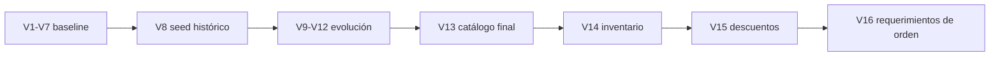

# Feature: persistencia y migraciones Flyway

## Alcance

PostgreSQL + Flyway + JPA `validate` forman la frontera persistente de LaunchForge.

El estado actual se obtiene aplicando migraciones `V1` a `V16`.

## Tablas principales

- `users`, `roles`, `user_roles`;
- `categories`, `products`;
- `inventory`;
- `orders`, `order_items`;
- `discount_configuration`, `order_discounts`;
- `audit_log`.

## Decisiones

- UUID para recursos principales;
- `BigDecimal` / `NUMERIC` para dinero;
- `Instant` / `TIMESTAMPTZ` para tiempo;
- enums como texto;
- `@Version` para inventario;
- snapshot comercial en `order_items`;
- JSONB solo para metadata flexible de auditoría.

## Evolución



`V13` elimina los usuarios históricos de seed y carga el catálogo final. Por tanto, el entorno final no depende de cuentas demo.

`V14` crea inventario `0/0` para los productos.

`V15` restaura las tres reglas de descuento deshabilitadas inicialmente.

`V16` agrega datos comerciales del requerimiento a `orders`.

## Regla de migración

Una migración compartida no se edita.

El siguiente cambio debe crear `V17__...`.

## Tests

Testcontainers valida:

- Flyway completo;
- `ddl-auto=validate`;
- constraints;
- relaciones;
- PostgreSQL real;
- optimistic locking.

## Diagnóstico

```sql
SELECT *
FROM flyway_schema_history
ORDER BY installed_rank;
```

No usar H2 para sustituir las integraciones PostgreSQL.
