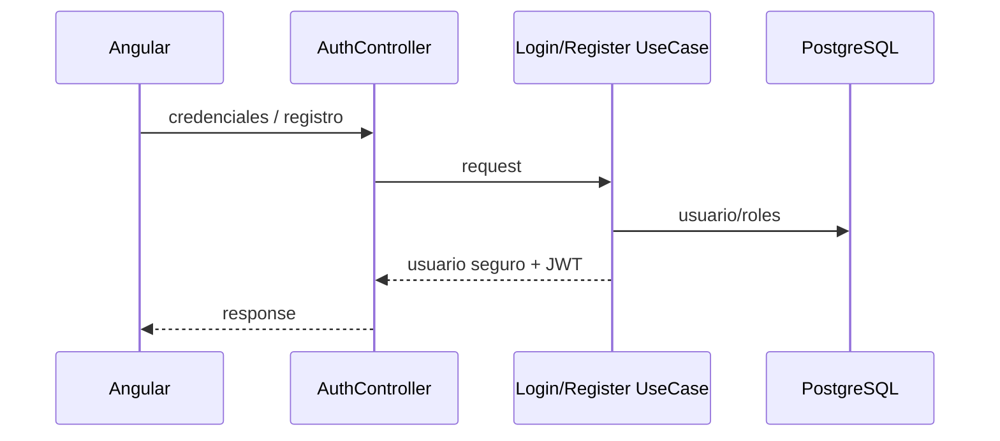

# Feature: authentication and authorization

## Alcance

- registro;
- login;
- JWT;
- BCrypt;
- Spring Security stateless;
- `ADMIN` / `CUSTOMER`;
- `@PreAuthorize`;
- frontend auth store, interceptor y guards.

## Endpoints

```text
POST /api/v1/auth/register
POST /api/v1/auth/login
```

## Flujo



El registro asigna `CUSTOMER`.

## Primer administrador

No se seed-ea un administrador listo para autenticarse.

Bootstrap:

```text
registrar CUSTOMER
-> asignar ADMIN en user_roles
-> nuevo login
-> administrar usuarios desde la UI
```

No crear manualmente hashes de contraseña.

## JWT

Claims:

- `sub`;
- `email`;
- `roles`;
- `iat`;
- `exp`.

## Seguridad

- guards Angular = UX;
- backend = frontera real;
- nunca se retorna `password_hash`.

## Diagnóstico

- `401`: token/header/expiración/secret;
- `403`: roles/autoridades;
- login: email, BCrypt, `AuthenticationManager`;
- rol cambiado: cerrar sesión y emitir token nuevo.
