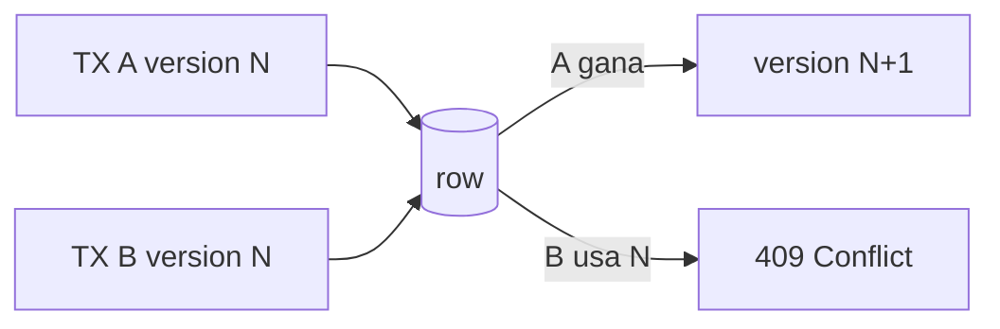

# Feature: inventory management y concurrencia

## Modelo

Inventario representa capacidad operativa.

```text
available_quantity
reserved_quantity
version
```

Una orden `CREATED`:

```text
available -= quantity
reserved  += quantity
```

Confirmar:

```text
reserved -= quantity
```

Cancelar `CREATED`:

```text
reserved  -= quantity
available += quantity
```

## Endpoints ADMIN

- `GET /api/v1/inventory`
- `GET /api/v1/inventory/{productId}`
- `PATCH /api/v1/inventory/{productId}`

Operaciones administrativas:

- `INCREASE`;
- `DECREASE`;
- `RESTORE`.

## Flujo

```text
InventoryController
 -> InventoryManagementService
 -> Inventory
 -> InventoryRepository
 -> PostgreSQL
```

## Optimistic locking

`inventory.version` está mapeado con `@Version`.



Esto evita overselling sin locks en memoria.

## Invariantes

- disponible >= 0;
- reservado >= 0;
- cantidad de operación > 0.

## Errores

- `400`: payload;
- `404`: inventario inexistente;
- `409`: capacidad insuficiente;
- `409`: versión obsoleta.

## Escalamiento

Pessimistic locking solo debería evaluarse si métricas reales muestran contención alta y reintentos frecuentes.
