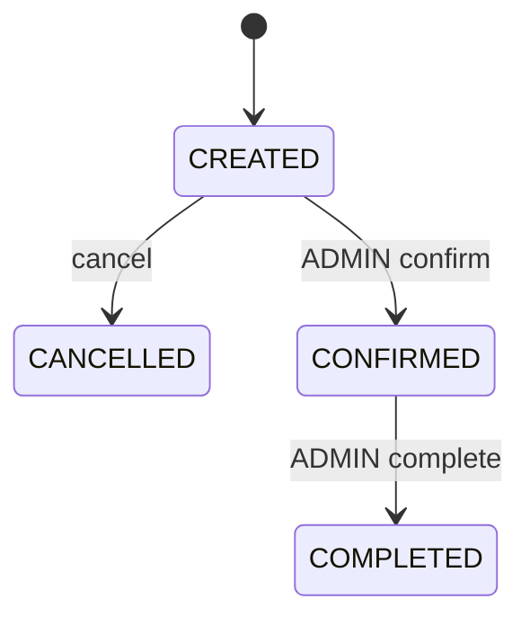

# Feature: orders, transacciones e idempotencia

## Alcance

El módulo implementa:

- creación de órdenes `CREATED`;
- requerimientos comerciales;
- reserva de inventario;
- consulta;
- idempotencia;
- confirmación administrativa;
- completado;
- cancelación de órdenes pendientes;
- snapshot de items;
- descuentos durante creación.

## Endpoints

### CUSTOMER

- `POST /api/v1/orders`
- `GET /api/v1/orders`
- `GET /api/v1/orders/{id}`
- `PATCH /api/v1/orders/{id}/cancel`

### ADMIN

- `GET /api/v1/orders/admin`
- `GET /api/v1/orders/{id}`
- `PATCH /api/v1/orders/{id}/cancel`
- `PATCH /api/v1/orders/{id}/confirm`
- `PATCH /api/v1/orders/{id}/complete`

## Estados



Solo `CREATED` puede cancelarse.

## Creación

```text
Angular checkout
 -> OrdersApiService
 -> OrderController
 -> CreateOrderUseCase
 -> TransactionalOrderCreator
 -> Inventory + DiscountEngine + OrderRepository
 -> PostgreSQL
```

Dentro de la transacción:

1. validar cliente;
2. validar request;
3. consolidar items;
4. cargar productos;
5. reservar capacidad;
6. crear snapshots;
7. evaluar descuentos;
8. persistir orden/items/descuentos.

## Requerimientos

Además de items, la API recibe:

- `requirementDescription`;
- `projectObjective`;
- `contactEmail`;
- `contactPhone`;
- `desiredDeliveryDate`;
- `referencesUrl`.

## Idempotencia

`Idempotency-Key` se evalúa por cliente.

Repetir la misma intención con la misma llave no debe crear otra orden.

## Snapshot

`order_items` preserva:

- `product_name`;
- `sku`;
- `unit_price`;
- `subtotal`.

## Cancelación

`CancelOrderUseCase`:

1. valida orden;
2. valida ownership/ADMIN;
3. exige `CREATED`;
4. llama `releaseReservation` por item;
5. cambia a `CANCELLED`;
6. persiste.

No se restaura capacidad de una orden confirmada porque la cancelación de `CONFIRMED` no está permitida.

## Seguridad

- crear requiere `CUSTOMER`;
- cancelar acepta propietario `CUSTOMER` o `ADMIN`;
- confirmar/completar requieren `ADMIN`;
- lectura del cliente valida ownership.

## Errores

- `400`: request inválido;
- `401`: sin JWT;
- `403`: ownership/rol;
- `404`: orden/producto/usuario;
- `409`: capacidad;
- `409`: producto inactivo;
- `409`: idempotencia;
- `409`: transición de estado inválida.

## Prueba

Usar un usuario registrado por la aplicación y un JWT real; no se depende de credenciales demo.

Crear:

```bash
curl -X POST http://localhost:8080/api/v1/orders \
  -H "Authorization: Bearer <jwt>" \
  -H "Idempotency-Key: order-test-001" \
  -H "Content-Type: application/json" \
  -d '{
    "items":[{"productId":"<product-id>","quantity":1}],
    "requirementDescription":"Descripción funcional del proyecto",
    "projectObjective":"Objetivo principal",
    "contactEmail":"cliente@ejemplo.com",
    "contactPhone":"+57 3000000000",
    "desiredDeliveryDate":"2026-10-30",
    "referencesUrl":"https://example.com"
  }'
```
