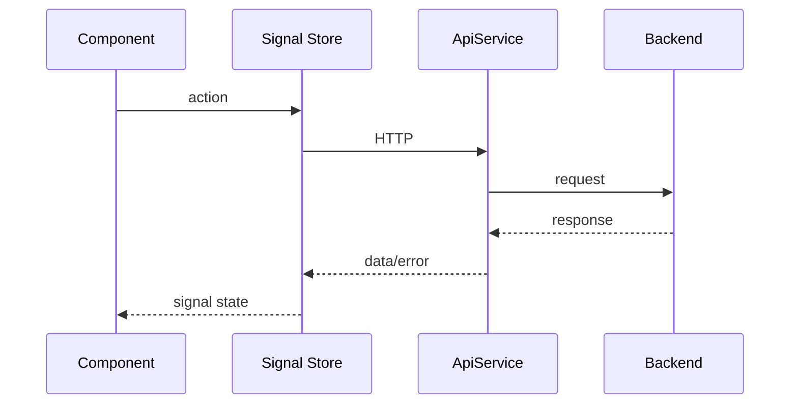

# Angular en LaunchForge

Angular 21 implementa la SPA con Angular Material y NgRx Signals 21.

## Organización

```text
core/
shared/
features/
```

## Auth

- `AuthStore`;
- `AuthApiService`;
- `authInterceptor`;
- `authGuard`;
- `roleGuard`;
- login/register;
- sesión persistida.

## Flujo



## Seguridad

Los guards solo mejoran UX.

El backend decide autorización.

## Checkout

- `Idempotency-Key` se conserva para retry;
- cambiar intención genera una nueva;
- validaciones del backend se muestran mediante Problem Details;
- requerimientos comerciales se envían junto con items.

## Verificación

```bash
npm ci
npm run lint
npm test -- --watch=false
npm run build
```

## Diagnóstico

- sesión/token;
- interceptor;
- route guards;
- roles;
- respuestas 401/403/409;
- errores de peer dependencies.
