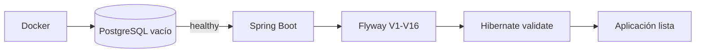

# PostgreSQL, Flyway y JPA en LaunchForge

## Ciclo real



## Responsabilidades

- Docker: proceso, red, volumen y variables;
- Flyway: esquema;
- Hibernate/JPA: mapping y validación;
- PostgreSQL: constraints, persistencia, locking y agregaciones.

## Migraciones

Actualmente:

```text
V1 ... V16
```

Consultar `migration-plan.md` para detalle.

Una migración compartida no se edita.

## Estado final de datos

`V13` elimina cuentas históricas del seed y carga el catálogo final.

`V14` inicializa inventario.

`V15` restaura configuración de descuentos deshabilitada.

`V16` agrega requerimientos de órdenes.

## Mapeos

- `NUMERIC(19,2)` <-> `BigDecimal`;
- `TIMESTAMPTZ` <-> `Instant`;
- estado <-> `EnumType.STRING`;
- JSONB <-> metadata;
- `version` <-> `@Version`.

## Conectividad

Dentro de Compose:

```text
jdbc:postgresql://db:5432/launchforge
```

Desde host, usar el puerto publicado en `.env`.

Con `.env.example`:

```text
localhost:55432
```

## Diagnóstico

```bash
docker compose ps
docker compose logs db
docker compose logs backend
docker compose exec db pg_isready -U launchforge -d launchforge
```

```sql
SELECT *
FROM flyway_schema_history
ORDER BY installed_rank;
```

No usar H2 para sustituir integraciones PostgreSQL.
