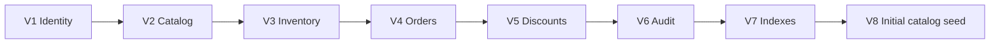

# LaunchForge — Migraciones Flyway

## Objetivo

Flyway es la única fuente de verdad para crear y evolucionar el esquema de PostgreSQL.

Ruta:

```text
backend/src/main/resources/db/migration/
```

La baseline actual del proyecto está compuesta por ocho migraciones:



## Regla de evolución

Las migraciones `V1` a `V8` representan la baseline consolidada actual del proyecto.

Una vez que esta baseline sea utilizada en un entorno compartido o desplegado, sus migraciones deben considerarse **inmutables**.

Todo cambio posterior debe expresarse mediante una nueva migración incremental.

```text
NO modificar V1..V8 después de publicar la baseline.

Crear V9__... para el siguiente cambio de esquema o datos.
```

Durante el desarrollo inicial se consolidó el historial de migraciones porque la aplicación aún no dependía de una base compartida o productiva. Esto permitió eliminar migraciones intermedias y destructivas y dejar una secuencia reproducible desde una base vacía.

A partir de esta baseline, el historial debe evolucionar únicamente hacia adelante.

---

## V1 — Identity

`V1__create_identity.sql`

Crea las estructuras relacionadas con usuarios y autorización:

- `users`;
- `roles`;
- `user_roles`.

Roles base:

- `ADMIN`;
- `CUSTOMER`.

La migración registra únicamente los roles necesarios para operar la aplicación.

No crea usuarios de demostración ni un administrador listo para usar.

El primer usuario se registra mediante el flujo normal de autenticación y, cuando se requiere un administrador inicial, el rol `ADMIN` se asigna posteriormente siguiendo el procedimiento documentado en el README.

---

## V2 — Catalog

`V2__create_catalog.sql`

Crea las estructuras principales del catálogo:

- `categories`;
- `products`.

Incluye restricciones para proteger la integridad del dominio, entre ellas:

- nombres y slugs únicos cuando corresponde;
- SKU único;
- precios no negativos;
- relaciones entre productos y categorías.

Esta migración contiene únicamente estructura y restricciones.

Los datos iniciales del catálogo se cargan posteriormente en `V8`.

---

## V3 — Inventory

`V3__create_inventory.sql`

Crea la tabla `inventory`.

Campos principales:

```text
available_quantity
reserved_quantity
version
```

Incluye:

- cantidades disponibles no negativas;
- cantidades reservadas no negativas;
- relación 1:1 entre producto e inventario;
- campo `version` inicializado en `0`.

El campo `version` es utilizado por Hibernate mediante optimistic locking para proteger las actualizaciones concurrentes de inventario.

La disponibilidad efectiva se determina considerando tanto la cantidad disponible como las unidades reservadas por órdenes pendientes.

---

## V4 — Orders

`V4__create_orders.sql`

Crea:

- `orders`;
- `order_items`.

Esta migración concentra la estructura final requerida actualmente para el flujo de órdenes.

### Estados de orden

Los estados soportados son:

```text
CREATED
CONFIRMED
CANCELLED
COMPLETED
```

### Integridad monetaria

Incluye restricciones para proteger:

- subtotal no negativo;
- descuentos no negativos;
- total no negativo;
- cantidades de items positivas;
- precios unitarios no negativos.

### Idempotencia

La creación de órdenes puede utilizar una `idempotency_key`.

La base de datos protege la unicidad de la intención de compra mediante:

```text
(customer_id, idempotency_key)
```

cuando la llave está presente.

Esto evita crear órdenes duplicadas cuando un cliente reintenta la misma solicitud.

### Snapshots comerciales

`order_items` conserva los valores comerciales utilizados al momento de crear una orden, evitando depender de cambios posteriores en el catálogo.

### Requerimientos comerciales

La orden también almacena información adicional del requerimiento:

```text
requirement_description
project_objective
contact_email
contact_phone
desired_delivery_date
references_url
```

Estos campos permiten que la orden represente tanto los productos solicitados como el contexto comercial del proyecto.

---

## V5 — Discounts

`V5__create_discounts.sql`

Crea:

- `discount_configuration`;
- `order_discounts`.

Las reglas configurables actualmente soportadas son:

```text
TIME_RANGE
RANDOM_ORDER
FREQUENT_CUSTOMER
```

La migración crea también la configuración inicial de las tres reglas.

| Code | Porcentaje | Estado inicial | Parámetros |
| --- | ---: | --- | --- |
| `TIME_RANGE` | 10% | deshabilitado | rango configurable |
| `RANDOM_ORDER` | 50% | deshabilitado | rango configurable |
| `FREQUENT_CUSTOMER` | 5% | deshabilitado | 5 órdenes / 12 meses |

Las reglas temporales no tienen fechas de negocio fijas dentro de la baseline.

La configuración se habilita y modifica posteriormente desde la administración de la aplicación.

Los descuentos aplicados a una orden se almacenan en `order_discounts`, conservando trazabilidad de:

- regla aplicada;
- porcentaje;
- valor descontado.

---

## V6 — Audit

`V6__create_audit.sql`

Crea `audit_log`.

La tabla permite registrar eventos relevantes producidos por operaciones del sistema.

Entre la información almacenada se encuentra:

- actor;
- acción;
- tipo de recurso;
- identificador del recurso;
- correlation ID;
- dirección IP;
- metadata JSONB;
- fecha del evento.

La auditoría forma parte de la misma frontera transaccional de las operaciones críticas de negocio cuando corresponde.

---

## V7 — Indexes

`V7__create_indexes.sql`

Consolida los índices necesarios para las consultas principales de la aplicación.

Incluye índices orientados a:

- catálogo;
- búsquedas de productos;
- inventario;
- órdenes;
- items de órdenes;
- descuentos;
- auditoría;
- reportes.

Entre los campos utilizados para búsqueda y filtrado se encuentran características como:

- precio del producto;
- disponibilidad de inventario;
- estados de orden;
- relaciones entre cliente y orden.

Esta migración mantiene separados los aspectos estructurales de las optimizaciones de consulta.

---

## V8 — Datos iniciales de catálogo

`V8__seed_demo_data.sql`

Carga los datos mínimos necesarios para que una instalación nueva tenga un catálogo reproducible.

Incluye:

- 6 categorías;
- 10 productos;
- inventario inicial para los productos.

Cada producto recibe inicialmente:

```text
available_quantity = 10
reserved_quantity  = 0
version            = 0
```

Esta migración **no crea usuarios de demostración**.

Tampoco crea:

- órdenes;
- registros de auditoría;
- descuentos aplicados;
- administradores preconfigurados.

Las configuraciones de descuentos pertenecen a `V5` y permanecen inicialmente deshabilitadas.

---

## Resultado de una instalación nueva

Al ejecutar las migraciones sobre una base de datos vacía, Flyway debe aplicar exactamente:

```text
V1
V2
V3
V4
V5
V6
V7
V8
```

El test de integración de persistencia verifica esta condición consultando `flyway_schema_history`.

El resultado esperado es:

```text
8 migraciones exitosas
```

en el siguiente orden:

```text
1
2
3
4
5
6
7
8
```

---

## Verificación manual

El historial puede consultarse directamente en PostgreSQL:

```sql
SELECT
    installed_rank,
    version,
    description,
    script,
    checksum,
    installed_on,
    success
FROM flyway_schema_history
ORDER BY installed_rank;
```

Una instalación nueva debe mostrar únicamente las ocho versiones de la baseline.

---

## Validación desde cero

Para validar completamente la creación de la base en un entorno local:

```bash
docker compose down -v
docker compose up --build
```

Esto elimina el volumen local de PostgreSQL y obliga a Flyway a reconstruir todo el esquema desde una base vacía.

> `docker compose down -v` elimina los datos persistidos en los volúmenes asociados al Compose. Debe utilizarse únicamente cuando se desea reconstruir deliberadamente una base de desarrollo.

Después del arranque se puede validar el estado de los servicios con:

```bash
docker compose ps
```

La aplicación debe iniciar únicamente después de que PostgreSQL esté disponible y las migraciones hayan terminado correctamente.

---

## Evolución futura

La siguiente modificación de esquema o datos deberá iniciar en:

```text
V9__descripcion_del_cambio.sql
```

Ejemplos:

```text
V9__add_product_attribute.sql
V10__create_supplier_table.sql
V11__add_order_reporting_index.sql
```

Las nuevas migraciones deben:

1. ser incrementales;
2. evitar operaciones destructivas innecesarias;
3. mantener compatibilidad con datos existentes;
4. poder ejecutarse automáticamente durante el arranque;
5. quedar cubiertas por la validación de integración cuando modifiquen la estructura esperada.

Una vez publicada esta baseline, ninguna migración existente entre `V1` y `V8` debe ser reescrita para corregir una base ya desplegada.
