# LaunchForge — Migraciones Flyway

## Objetivo

Flyway es la única fuente de verdad para crear y evolucionar el esquema de PostgreSQL.

Ruta:

```text
backend/src/main/resources/db/migration/
```



```mermaid
flowchart LR
    V1[V1 Identity] --> V2[V2 Catalog]
    V2 --> V3[V3 Inventory]
    V3 --> V4[V4 Orders]
    V4 --> V5[V5 Discounts]
    V5 --> V6[V6 Audit]
    V6 --> V7[V7 Indexes]
    V7 --> V8[V8 Seed histórico]
    V8 --> V9[V9 Search indexes]
    V9 --> V10[V10 Random range]
    V10 --> V11[V11 Discount alignment]
    V11 --> V12[V12 Reservation reconciliation]
    V12 --> V13[V13 Reset + product catalog]
    V13 --> V14[V14 Inventory initialization]
    V14 --> V15[V15 Discount configuration]
    V15 --> V16[V16 Order requirements]
```

## Regla de evolución

Una migración compartida **no se edita**.

Todo cambio posterior se expresa mediante una nueva versión incremental.

```text
NO modificar V1..V16 para corregir una base existente.
Crear V17__... cuando aparezca el siguiente cambio.
```

## V1 — Identity

`V1__create_identity.sql`

Crea:

- `users`;
- `roles`;
- `user_roles`.

Roles base:

- `ADMIN`;
- `CUSTOMER`.

No crea un administrador de aplicación listo para usar. El bootstrap del primer administrador se realiza después del registro normal, asignando el rol mediante PostgreSQL tal como se documenta en el README.

## V2 — Catalog

`V2__create_catalog.sql`

Crea:

- `categories`;
- `products`.

Incluye unicidad para nombres/slugs/SKU y protección de precio no negativo.

## V3 — Inventory

`V3__create_inventory.sql`

Crea `inventory` con:

- `available_quantity`;
- `reserved_quantity`;
- `version`.

Incluye restricciones de cantidades no negativas y relación 1:1 con producto.

## V4 — Orders

`V4__create_orders.sql`

Crea:

- `orders`;
- `order_items`.

Incluye:

- `order_number` único;
- valores monetarios no negativos;
- cantidad positiva;
- estados `CREATED`, `CONFIRMED`, `CANCELLED`, `COMPLETED`;
- idempotencia por `(customer_id, idempotency_key)` cuando la llave existe.

## V5 — Discounts

`V5__create_discounts.sql`

Crea:

- `discount_configuration`;
- `order_discounts`.

Códigos de reglas:

- `TIME_RANGE`;
- `RANDOM_ORDER`;
- `FREQUENT_CUSTOMER`.

## V6 — Audit

`V6__create_audit.sql`

Crea `audit_log` con:

- actor;
- acción;
- recurso;
- correlation ID;
- IP;
- metadata JSONB;
- fecha.

## V7 — Indexes

`V7__create_indexes.sql`

Añade índices orientados a consultas de:

- catálogo;
- órdenes;
- items;
- descuentos;
- auditoría.

## V8 — Seed histórico inicial

`V8__seed_demo_data.sql`

Fue parte del baseline inicial y aportó datos reproducibles para desarrollo y pruebas.

Las migraciones posteriores pueden transformar o reemplazar esos datos; no debe asumirse que las cuentas históricas de V8 siguen disponibles en el estado final de una base nueva.

## V9 — Product search indexes

`V9__create_product_search_indexes.sql`

Añade índices para:

- `products.price`;
- `inventory.available_quantity`.

## V10 — Random discount range

`V10__configure_random_discount_range.sql`

Ajusta la configuración temporal de `RANDOM_ORDER`.

## V11 — Discount seed alignment

`V11__align_discount_seed_with_accumulative_rules.sql`

Alinea datos históricos con la regla final de descuentos acumulables sobre el subtotal original.

## V12 — Reservation reconciliation

`V12__reconcile_inventory_reservations.sql`

Normaliza `reserved_quantity` y reconstruye reservas a partir de órdenes `CREATED`, evitando reservas huérfanas al evolucionar el flujo pendiente/confirmada.

## V13 — Reset de datos y catálogo final

`V13__reset_demo_data_and_seed_products.sql`

Esta migración:

1. trunca datos funcionales previos;
2. reinicia identidades de catálogos secuenciales;
3. elimina usuarios históricos de seed;
4. reconstruye categorías;
5. carga el catálogo final de productos.

Tablas afectadas por el reset:

```text
audit_log
order_discounts
order_items
orders
inventory
discount_configuration
user_roles
users
products
categories
```

Como consecuencia, una base construida hasta `V16` **no depende de usuarios demo**.

## V14 — Inicialización de inventario

`V14__initialize_product_inventory.sql`

Crea una fila de inventario para todo producto que aún no la tenga:

```text
available_quantity = 0
reserved_quantity  = 0
version            = 0
```

El `ADMIN` puede ajustar después la capacidad desde la aplicación.

## V15 — Configuración final de descuentos

`V15__restore_discount_configuration.sql`

Restablece las tres configuraciones:

| Code | Porcentaje | Estado inicial | Parámetros |
|---|---:|---|---|
| `TIME_RANGE` | 10% | deshabilitado | rango configurable |
| `RANDOM_ORDER` | 50% | deshabilitado | rango configurable |
| `FREQUENT_CUSTOMER` | 5% | deshabilitado | 5 órdenes / 12 meses |

Las reglas se habilitan y configuran posteriormente desde administración.

## V16 — Requerimientos de orden

`V16__add_order_requirements.sql`

Añade a `orders`:

```text
requirement_description TEXT
project_objective TEXT
contact_email VARCHAR(180)
contact_phone VARCHAR(40)
desired_delivery_date DATE
references_url TEXT
```

Estos campos permiten que la orden represente no solo productos seleccionados sino el contexto comercial del proyecto solicitado.

## Verificación

Consultar:

```sql
SELECT
    installed_rank,
    version,
    description,
    script,
    checksum,
    installed_on,
    success
FROM flyway_schema_history
ORDER BY installed_rank;
```

Para validar todo el historial desde cero:

```bash
docker compose down -v
docker compose up --build
```

> `down -v` elimina el volumen local de PostgreSQL y debe utilizarse únicamente cuando se desea reconstruir una base de desarrollo.
