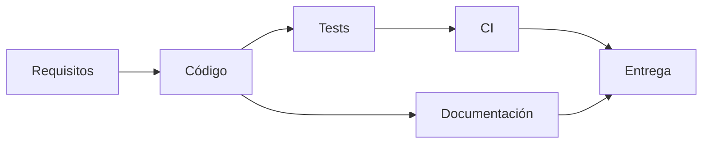

# Matriz de trazabilidad

Esta matriz relaciona los requisitos funcionales y técnicos con la implementación actual en `main`.

| Requisito | Implementación | Endpoint / módulo | Evidencia | Estado |
|---|---|---|---|---|
| Login | JWT stateless + BCrypt + Spring Security | `/api/v1/auth/login` | `LoginUseCase`, tests auth | COMPLETED |
| Registro | Alta de usuario con rol `CUSTOMER` | `/api/v1/auth/register` | `RegisterUserUseCase`, tests auth | COMPLETED |
| Gestión de usuarios | Listado, activación/bloqueo y cambio de rol | `/api/v1/admin/users` | `AdminUserController`, `AdminUserService` | COMPLETED |
| Catálogo | Consulta pública paginada | `/api/v1/products` | `ProductCatalogService`, integración | COMPLETED |
| Búsqueda | Specifications por nombre, SKU, categoría, precio, activo y disponibilidad | `/api/v1/products` | `ProductSpecifications` | COMPLETED |
| CRUD de productos | Alta, actualización, estado y eliminación/desactivación | `/api/v1/products` | `ProductController` + tests | COMPLETED |
| Inventario | Capacidad disponible/reservada + optimistic locking | `/api/v1/inventory` | `InventoryManagementService`, `InventoryConcurrencyIntegrationTest` | COMPLETED |
| Órdenes | Creación, consulta, confirmación, completado y cancelación válida | `/api/v1/orders` | casos de uso de órdenes + tests | COMPLETED |
| Requerimientos de orden | Descripción, objetivo, contacto, fecha y referencias | `CreateOrderRequest`, `orders` | `V16__add_order_requirements.sql` | COMPLETED |
| Idempotencia | `Idempotency-Key` + unicidad por cliente | `POST /api/v1/orders` | ADR + tests | COMPLETED |
| Snapshot comercial | Nombre, SKU y precio histórico en item | `order_items` | modelo/migraciones/tests | COMPLETED |
| Descuento temporal | Strategy configurable | `TIME_RANGE` | `DiscountEngineTest`, integración | COMPLETED |
| Orden aleatoria 50% | Strategy + `RandomProvider` | `RANDOM_ORDER` | tests deterministas | COMPLETED |
| Cliente frecuente 5% | Conteo histórico parametrizable | `FREQUENT_CUSTOMER` | strategy + integración | COMPLETED |
| Productos activos | Agregación en PostgreSQL | `/api/v1/reports/active-products` | repository/controller tests | COMPLETED |
| Top 5 productos | `SUM(quantity)` sobre ventas válidas | `/api/v1/reports/top-products` | repository/controller tests | COMPLETED |
| Top 5 clientes | `COUNT(order)` sobre ventas válidas | `/api/v1/reports/top-customers` | repository/controller tests | COMPLETED |
| Dashboard | KPIs, estados, capacidad y tendencia mensual | `/api/v1/reports/dashboard` | repository/store tests | COMPLETED |
| Auditoría | AOP transaccional + consulta administrativa | `/api/v1/audit` | `AuditAspect`, integración y MockMvc | COMPLETED |
| Migraciones | Flyway como fuente del esquema, `V1` a `V16` | `db/migration` | `flyway_schema_history`, tests | COMPLETED |
| Hibernate seguro | Validación sin DDL implícito | `ddl-auto=validate` | configuración Spring | COMPLETED |
| Docker | PostgreSQL + backend + frontend con healthchecks | `docker-compose.yml` | `docker compose config` | COMPLETED |
| Tests backend | Unitarios, MockMvc, PostgreSQL/Testcontainers | `backend/src/test` | `mvn clean verify` | COMPLETED |
| Tests frontend | Stores, guards, interceptor y componentes | `frontend/src/**/*.spec.ts` | CI frontend | COMPLETED |
| Análisis estático | Spotless, PMD, ESLint y JaCoCo | build / workflows | CI | COMPLETED |
| CI | Workflows independientes backend/frontend | `.github/workflows` | Actions verdes en `main` | COMPLETED |
| Continuous Delivery | Imágenes multi-arquitectura + SBOM/provenance en GHCR | `release.yml` | workflow versionado | COMPLETED |
| Continuous Deployment | Requiere proveedor/entorno real | — | decisión documentada | OUT OF SCOPE |
| Documentación | README + `docs/` | repositorio | documentos técnicos | COMPLETED |
| Video de funcionamiento | Entregable externo | — | debe adjuntarse a la entrega | PENDING EXTERNAL |

## Cobertura de la prueba

Los elementos `OUT OF SCOPE` no representan incumplimientos del challenge: son capacidades deseables que requieren infraestructura externa no definida.

El video se mantiene como entregable externo al repositorio y debe grabarse sobre la versión final validada.
