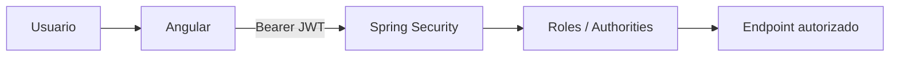

# Security

LaunchForge usa Spring Security stateless, JWT y autorización backend mediante `@PreAuthorize`.



## Autenticación

- passwords procesadas con BCrypt;
- JWT emitido después de autenticación válida;
- no se mantiene `HttpSession`;
- el backend reconstruye el contexto en cada request.

Claims relevantes:

- `sub`: UUID del usuario;
- `email`;
- `roles`;
- `iat`;
- `exp`.

## Roles

```text
ADMIN
CUSTOMER
```

Se proyectan como:

```text
ROLE_ADMIN
ROLE_CUSTOMER
```

## Bootstrap del primer administrador

El registro público siempre crea un usuario `CUSTOMER`.

La instalación final no depende de usuarios demo.

Para crear el primer `ADMIN`:

1. registrar el usuario mediante la aplicación;
2. asignar `ADMIN` en la tabla `user_roles` mediante PostgreSQL;
3. cerrar sesión;
4. iniciar sesión nuevamente para emitir un JWT con el rol actualizado.

No se debe crear manualmente un password/hash en la base de datos.

Después del bootstrap, la gestión de roles y estado se realiza desde:

```text
GET   /api/v1/admin/users
PATCH /api/v1/admin/users/{id}
```

## 401 y 403

- `401`: autenticación ausente, inválida o expirada;
- `403`: identidad válida sin permisos suficientes o acceso a un recurso ajeno.

Los guards Angular mejoran la navegación, pero nunca sustituyen la autorización backend.

## Auditoría

`GET /api/v1/audit` requiere `ROLE_ADMIN`.

El actor se obtiene del `sub` del JWT validado. Cuando una operación no tiene usuario autenticado —por ejemplo registro público o un proceso técnico— `actor_user_id` puede ser `NULL`; no se inventa un usuario.

## Datos prohibidos

Logs, MDC y metadata de auditoría deben excluir:

- password;
- `password_hash`;
- JWT completo;
- `JWT_SECRET`;
- headers `Authorization`;
- payloads completos con datos innecesarios.

## Correlation ID

`X-Correlation-Id` se acepta cuando cumple:

```text
[A-Za-z0-9._-]{1,100}
```

Si falta o es inválido se reemplaza por UUID.

Se devuelve en la respuesta y se añade a MDC.

## IP

La auditoría utiliza la IP de la conexión servlet.

`X-Forwarded-For` no se considera confiable automáticamente. Solo debería utilizarse tras configurar explícitamente proxies confiables.

## Secretos

`.env.example` contiene valores de desarrollo no seguros.

En entornos compartidos deben cambiarse:

- `POSTGRES_PASSWORD`;
- `SPRING_DATASOURCE_PASSWORD`;
- `JWT_SECRET`.

El archivo `.env` real no debe versionarse.
