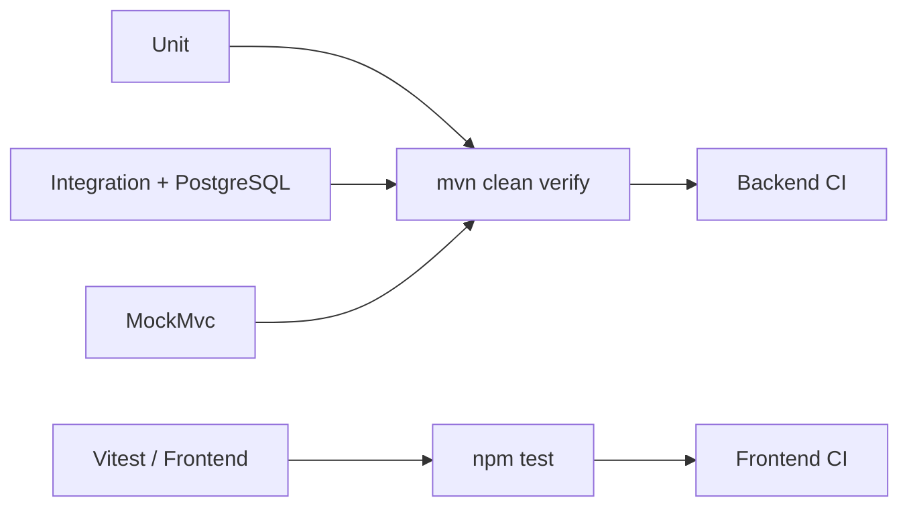

# Testing

## Objetivo

La suite valida reglas de negocio, persistencia PostgreSQL, contratos HTTP, seguridad y comportamiento crítico del frontend.



## Backend

Se utilizan tres niveles principales:

### Unitarias

Cubren:

- lógica de catálogo;
- invariantes de inventario;
- creación/cancelación/confirmación/completado de órdenes;
- idempotencia;
- `DiscountEngine`;
- estrategias de descuento;
- mappers y servicios donde corresponde.

### Integración PostgreSQL/Testcontainers

Cubren:

- ejecución Flyway;
- compatibilidad esquema/JPA;
- constraints;
- catálogo y búsqueda;
- optimistic locking real;
- descuentos;
- reportes;
- auditoría.

No se sustituye PostgreSQL por H2.

### MockMvc

Valida:

- contratos REST;
- validaciones;
- autenticación;
- autorización;
- ownership;
- Problem Details;
- endpoints administrativos.

## Frontend

La suite cubre stores y piezas críticas, incluyendo:

- `AuthStore`;
- guards e interceptor;
- `CatalogStore`;
- formulario de producto;
- `CartStore`;
- `OrdersStore`;
- inventario;
- descuentos administrativos;
- `ReportStore`;
- auditoría;
- estados `loading/error/empty/success`.

## Comandos

### Backend

```bash
cd backend
mvn clean verify
```

Para iteración rápida:

```bash
mvn test
```

El gate final es `clean verify`.

### Frontend

```bash
cd frontend
npm ci
npm run lint
npm test -- --watch=false
npm run build
```

### Compose

```bash
docker compose up --build
```

## Catálogo

Se valida:

- CRUD;
- acceso público vs `ADMIN`;
- filtros en base de datos;
- paginación;
- sorting;
- SKU/slug duplicados;
- productos activos/inactivos;
- disponibilidad.

## Inventario

Se valida:

- lectura/ajuste administrativo;
- `INCREASE`, `DECREASE`, `RESTORE`;
- rechazo por capacidad insuficiente;
- rechazo de versión obsoleta;
- optimistic locking con transacciones reales.

### Escenario concurrente

1. dos transacciones leen la misma fila y versión;
2. ambas intentan modificarla;
3. una persiste;
4. la segunda falla;
5. el inventario nunca queda negativo.

## Órdenes

Se valida:

- creación `CREATED`;
- consolidación de items repetidos;
- snapshot comercial;
- requerimientos del proyecto;
- `Idempotency-Key`;
- rechazo de producto inactivo;
- rechazo de capacidad insuficiente;
- ownership;
- reserva de inventario;
- confirmación `CREATED -> CONFIRMED`;
- completado `CONFIRMED -> COMPLETED`;
- cancelación exclusiva de `CREATED`;
- liberación de reserva en cancelación;
- rechazo de cancelación para `CONFIRMED`/`COMPLETED`.

### Validación manual recomendada

1. registrar/autenticar un `CUSTOMER`;
2. crear una orden con `Idempotency-Key`;
3. repetir el POST con la misma llave;
4. confirmar que no se crea una segunda orden;
5. consultar inventario y verificar reserva;
6. cancelar mientras siga `CREATED`;
7. comprobar que `reserved_quantity` disminuye y la capacidad se libera.

## Descuentos

Se valida:

- orden `TIME_RANGE -> RANDOM_ORDER -> FREQUENT_CUSTOMER`;
- configuración en DB;
- acumulación sobre subtotal original;
- `COUNT` de cliente frecuente;
- random determinista mediante `RandomProvider`;
- persistencia de `order_discounts`;
- conservación histórica;
- edición administrativa.

### Validación manual

1. crear un usuario normal;
2. configurar reglas desde `/admin/discounts`;
3. preparar condiciones de elegibilidad cuando sea necesario;
4. crear una orden;
5. inspeccionar `discountTotal`, `total` y `discounts`;
6. consultar `order_discounts`;
7. modificar la configuración y confirmar que la orden histórica no cambia.

No se depende de cuentas demo predefinidas.

## Reportes

Se valida:

- productos inactivos excluidos del reporte de activos;
- `SUM(quantity)` para top productos;
- `COUNT(order)` para top clientes;
- solo `CONFIRMED/COMPLETED`;
- `CREATED/CANCELLED` excluidas de rankings;
- límite cinco;
- desempates deterministas;
- `ADMIN 200`;
- `CUSTOMER 403`;
- anónimo `401`;
- dashboard financiero/operativo.

## Auditoría

Se valida:

- eventos de negocio instrumentados;
- actor;
- correlation ID;
- metadata permitida;
- rollback sin evento de éxito;
- filtros;
- paginación;
- autorización.

## Fixtures mutables

Las pruebas que modifican inventario u órdenes deben preparar un estado conocido y limpiar/restaurar únicamente sus datos.

Los tests no deben depender del orden de ejecución.

## CI

Backend CI ejecuta:

```text
mvn clean verify
```

Frontend CI ejecuta:

```text
npm ci
npm run lint
npm run test -- --watch=false
npm run build
```

Ambos workflows están verdes para el `main` validado durante la actualización de esta documentación.
