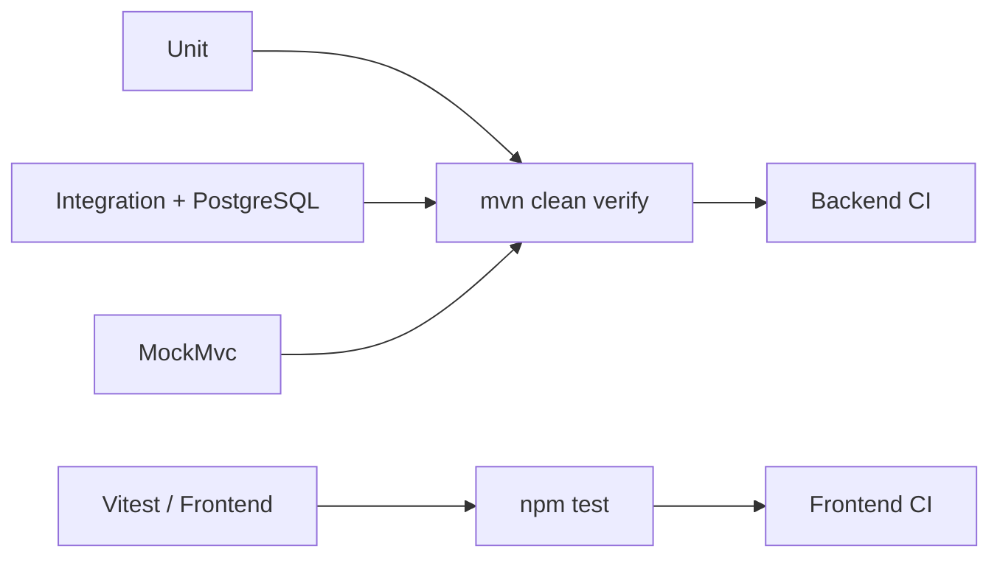

# Testing

## Objetivo

La suite valida reglas de negocio, persistencia PostgreSQL, contratos HTTP, seguridad y comportamiento crítico del frontend.



## Backend

Se utilizan tres niveles principales de pruebas.

### Unitarias

Cubren:

- lógica de catálogo;
- invariantes de inventario;
- creación, cancelación, confirmación y completado de órdenes;
- idempotencia;
- `DiscountEngine`;
- estrategias de descuento;
- mappers;
- servicios de aplicación donde corresponde.

Estas pruebas buscan aislar reglas de negocio y validar comportamientos sin depender de infraestructura externa cuando no es necesario.

### Integración PostgreSQL/Testcontainers

Cubren:

- ejecución de Flyway;
- aplicación completa de la baseline `V1` a `V8`;
- compatibilidad entre esquema y entidades JPA;
- constraints de base de datos;
- catálogo y búsqueda;
- optimistic locking real;
- flujo de descuentos;
- reportes;
- auditoría;
- persistencia de órdenes e inventario.

No se sustituye PostgreSQL por H2.

Las pruebas de integración utilizan PostgreSQL real mediante Testcontainers para reducir diferencias entre el entorno de test y el motor utilizado por la aplicación.

### Validación de Flyway

La suite verifica que una base vacía pueda construirse correctamente aplicando exactamente las ocho migraciones de la baseline actual:

```text
V1
V2
V3
V4
V5
V6
V7
V8
```

También valida el orden registrado en `flyway_schema_history`.

El objetivo es detectar:

- migraciones ausentes;
- versiones inesperadas;
- errores de creación del esquema;
- incompatibilidades entre Flyway y Hibernate;
- cambios accidentales en la baseline.

Una vez publicada la baseline, cualquier evolución posterior debe agregarse mediante una nueva versión incremental.

### MockMvc

Valida:

- contratos REST;
- validaciones;
- autenticación;
- autorización;
- ownership;
- Problem Details;
- endpoints administrativos.

Estas pruebas permiten verificar el comportamiento HTTP sin depender de un navegador.

## Frontend

La suite utiliza Vitest para validar stores y piezas críticas del cliente.

La cobertura funcional incluye:

- `AuthStore`;
- guards;
- interceptor;
- `CatalogStore`;
- formulario de producto;
- `CartStore`;
- `OrdersStore`;
- inventario;
- descuentos administrativos;
- `ReportStore`;
- auditoría;
- estados `loading`, `error`, `empty` y `success`.

Las pruebas de frontend complementan las validaciones del backend, pero no reemplazan la autorización ni las reglas de negocio implementadas en el servidor.

## Comandos

### Backend

```bash
cd backend
mvn clean verify
```

Para iteración rápida durante desarrollo:

```bash
mvn test
```

El gate final utilizado para validar el backend es:

```text
mvn clean verify
```

### Frontend

```bash
cd frontend
npm ci
npm run lint
npm test -- --watch=false
npm run build
```

### Compose

Para validar la integración completa de los servicios:

```bash
docker compose up --build
```

Cuando se necesita comprobar la construcción de PostgreSQL y Flyway desde cero en desarrollo:

```bash
docker compose down -v
docker compose up --build
```

> `docker compose down -v` elimina los volúmenes locales y debe utilizarse únicamente cuando se desea reconstruir deliberadamente la base de desarrollo.

## Catálogo

Se valida:

- CRUD;
- acceso público frente a operaciones exclusivas de `ADMIN`;
- filtros ejecutados en base de datos;
- paginación;
- sorting;
- SKU duplicado;
- slug duplicado;
- productos activos e inactivos;
- disponibilidad.

## Inventario

Se valida:

- lectura administrativa;
- ajuste administrativo;
- `INCREASE`;
- `DECREASE`;
- `RESTORE`;
- rechazo por capacidad insuficiente;
- rechazo de versión obsoleta;
- optimistic locking con transacciones reales.

### Escenario concurrente

El caso crítico de concurrencia reproduce el siguiente escenario:

1. dos transacciones leen la misma fila y la misma versión;
2. ambas intentan modificarla;
3. una transacción persiste correctamente;
4. la segunda encuentra una versión obsoleta;
5. la operación conflictiva falla;
6. el inventario mantiene sus invariantes y nunca queda negativo.

Esta prueba valida el comportamiento real de `@Version` contra PostgreSQL.

## Órdenes

Se valida:

- creación en estado `CREATED`;
- consolidación de items repetidos;
- snapshot comercial;
- requerimientos del proyecto;
- `Idempotency-Key`;
- rechazo de producto inactivo;
- rechazo de capacidad insuficiente;
- ownership;
- reserva de inventario;
- confirmación `CREATED -> CONFIRMED`;
- completado `CONFIRMED -> COMPLETED`;
- cancelación exclusiva de `CREATED`;
- liberación de reserva durante la cancelación;
- rechazo de cancelación para `CONFIRMED`;
- rechazo de cancelación para `COMPLETED`.

### Validación manual recomendada

1. registrar y autenticar un `CUSTOMER`;
2. crear una orden con `Idempotency-Key`;
3. repetir el `POST` con la misma llave;
4. confirmar que no se crea una segunda orden;
5. consultar inventario y verificar la reserva;
6. cancelar la orden mientras siga en `CREATED`;
7. comprobar que `reserved_quantity` disminuye y la capacidad se libera.

## Descuentos

Se valida:

- orden de trazabilidad `TIME_RANGE -> RANDOM_ORDER -> FREQUENT_CUSTOMER`;
- configuración almacenada en base de datos;
- acumulación de descuentos sobre el subtotal original;
- conteo utilizado para cliente frecuente;
- random determinista mediante `RandomProvider`;
- persistencia de `order_discounts`;
- conservación histórica;
- edición administrativa.

### Validación manual

1. crear un usuario normal;
2. configurar reglas desde `/admin/discounts`;
3. preparar las condiciones de elegibilidad cuando sea necesario;
4. crear una orden;
5. inspeccionar `discountTotal`, `total` y `discounts`;
6. consultar `order_discounts`;
7. modificar la configuración;
8. confirmar que la orden histórica no cambia.

La baseline no depende de cuentas demo predefinidas.

## Reportes

Se valida:

- productos inactivos excluidos del reporte de activos;
- `SUM(quantity)` para top de productos;
- `COUNT(order)` para top de clientes;
- únicamente órdenes `CONFIRMED` y `COMPLETED` en rankings;
- exclusión de `CREATED`;
- exclusión de `CANCELLED`;
- límite de cinco resultados;
- desempates deterministas;
- acceso `ADMIN` con respuesta permitida;
- acceso `CUSTOMER` rechazado;
- acceso anónimo rechazado;
- dashboard financiero y operativo.

## Auditoría

Se valida:

- eventos de negocio instrumentados;
- actor;
- correlation ID;
- metadata permitida;
- rollback sin evento de éxito;
- filtros;
- paginación;
- autorización.

La auditoría se valida junto con la frontera transaccional para evitar registrar operaciones que finalmente no fueron confirmadas.

## Fixtures mutables

Las pruebas que modifican inventario, órdenes o configuraciones deben preparar un estado conocido y limpiar o restaurar únicamente los datos que les pertenecen.

Los tests no deben depender del orden de ejecución.

Cada prueba debe poder ejecutarse de forma aislada y producir el mismo resultado.

## Cobertura JaCoCo

El backend genera el reporte de cobertura JaCoCo durante el proceso de verificación.

Ruta esperada:

```text
backend/target/site/jacoco/
```

En CI, el reporte se publica como artefacto `backend-jacoco` cuando está disponible.

La cobertura se utiliza como señal de calidad y diagnóstico; no sustituye la necesidad de validar escenarios relevantes de negocio, integración y concurrencia.

## CI

Backend CI ejecuta:

```text
mvn clean verify
```

Frontend CI ejecuta:

```text
npm ci
npm run lint
npm run test -- --watch=false
npm run build
```

El estado real de las ejecuciones debe consultarse en GitHub Actions para el commit o Pull Request evaluado.

La documentación no fija un SHA específico como referencia permanente, ya que el estado de `main` cambia con cada integración.

## Cobertura actual y límites

La suite cubre los flujos críticos de backend, persistencia, seguridad, frontend e integración.

Actualmente la estrategia se concentra en:

- unit tests;
- integration tests;
- Testcontainers;
- MockMvc;
- Vitest;
- validación con Docker Compose.

No se documenta una suite E2E de navegador como parte obligatoria del pipeline actual.

Una futura mejora puede incorporar pruebas E2E para recorridos completos como:

```text
registro
  ->
autenticación
  ->
selección de productos
  ->
creación de orden
  ->
administración
  ->
confirmación de orden
```

Estas pruebas complementarían la cobertura existente, pero deben mantenerse separadas de las reglas de negocio ya verificadas en backend.
